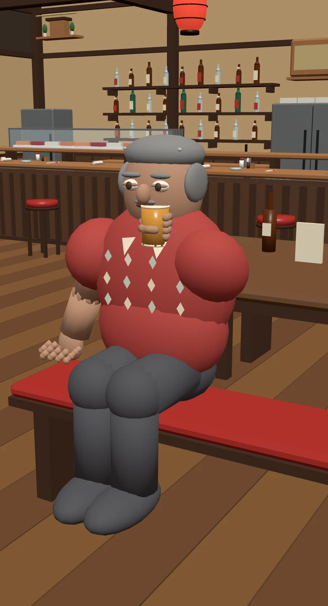
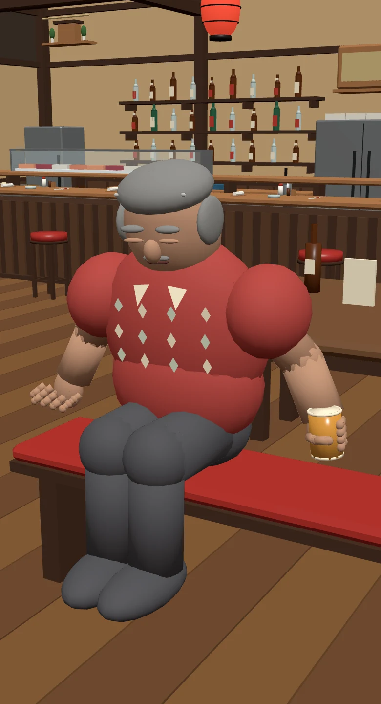

# Acceptance repair — 1 October 2026

Continued the validated PR #111 source at `6f31da1e41fb094370f4875c026e3596b21880d8`, already reapplied to `3557d778124b45746c2ae7cc7ee7af7ccc9f3516`. No second rebase, live registration, model manifest, save, schedule, service implementation or runtime bundle change was made.

**Decision: retain draft. Do not ship the bespoke model.** Technical animation/export checks pass. Visual acceptance remains incomplete, and isolated Chromium measurements do not establish whole-town performance on a physical phone.

## Corrected failures

- The drink chain is solved against a mouth contact target and baked to the existing arm/hand bones. The glass rim is now 0.0041 m from the mouth in Blender at frames 37–61, versus the previous approximately 0.598 m glass separation. Three.js exported skinning measures 0.0075 m to the amber cup surface during contact.
- Both clips remain seated for their entire approximately 6.04-second loop; sleep breathes gently instead of returning upright. All four exported eye meshes retain closed blink morphs at start, middle, end and across repeated loop boundaries. Exported sleep head-centre excursion is approximately 0.00165 m.
- Fingers form contiguous phalanges around the cup, with a visible rim, foam and base. Upper arm, elbow and forearm geometry now meet at bone joints, including during the sleep pose.
- The thigh and shin now have distinct weighted geometry with an overlapping knee; the disconnected floating shoes from the original seated render are removed. The high bench deliberately leaves feet above the floor.
- Oversized overlapping collar blocks were replaced with small flat lapels; raised shirt buttons were replaced with flat diamond motifs. These remove the previous oversized obstruction but do not yet establish an acceptable open-neck collar.
- Rigid components are consolidated by material before export. **115 → 15 skinned primitives**, 710,120 bytes and 9,166 exported vertices. Morph-bearing head/eyes remain separate to preserve their facial controls and animation tracks. A regression rejects exports exceeding the 16-primitive candidate budget; this budget is not a phone-performance approval.

## Preserved and verified

The regenerated audit passes with the same 51 bones, all 28 effectively weighted finger bones and five nonzero facial targets. Each finger still deforms independently after consolidation. Both expected clip names survive export, each with 158 channels including eye morph animation.

The Three.js CPU guest/service harness passes all seven previous schedule samples: permanent seating, free beer and 03:00–10:00 sleep boundaries remain intact. The new exported-animation audit passes contact, persistent closed eyes, loop continuity, finite geometry and primitive budget checks. Five export regression tests pass. The existing four focused gameplay files remain 19 pass / 1 failure: the previously established unchanged-main `resident-prop-beer` expectation in `resident-life`.

Local Blender Python 4.2 produced complete native scene, GLB, renders and passing audit. The initial final build and one repeat subsequently segfaulted during interpreter shutdown (exit 139), after export and audit completion. Both produced passing audit JSON. This repeatable Python-bpy shutdown failure remains an unresolved reproducibility defect. The independent Blender scene inspection and Three.js checks succeeded on those outputs. Native Blender CLI/Actions reproducibility remains to be confirmed with an assigned runner; no missing optional Draco library is required for this uncompressed export.

## Render evidence and remaining visual defects






- **Collar:** the small cream triangles still read as decoration on the chest rather than lapels meeting an open neckline. This is a visual rejection, despite removing the previous overlapping collar blocks.
- **Cup and sip:** the fingers now surround the cup and rim contact is close, but the cup is still opaque amber and held upright through the sipping hold. It needs a convincing transparent vessel and sip tilt without losing contact or grip.
- **Seated clothing:** thigh/knee/shin continuity is repaired, but the knee and trouser forms retain conspicuous hard junctions; the torso/belly shirt boundary also remains visible in the close phone render. Clean clothing deformation is not approved.

## Chromium acceptance

Chromium headless shell now launches without the earlier process-singleton socket failure. The harness serves a proper root document, so relative interior asset URLs resolve correctly, and views the front of the exported character.

Real WebGL ran at desktop 1280×720/DPR 1 and phone 390×720/DPR 2 with mobile/touch emulation. Both loaded the actual Minato interior and candidate GLB, rendered drink/sleep poses and preserved the 03:00/10:00 service transitions. See `review/browser-review.json` for renderer calls and warmed render/animation timings. The final comparison records desktop p95 3.2 ms versus live-render baseline 0.4 ms, and phone p95 4.5 ms versus 0.5 ms; baseline rendering excludes an AnimationMixer and is not a full gameplay cost comparison. Separate pose screenshots capture exported closed eyes and cup contact, rather than a rest-frame screenshot alone.

The candidate adds 13 renderer calls versus the live avatar in this isolated view (desktop total 23 versus 10; phone total 22 versus 9). Timing covers 120 synchronous render/animation samples after warm-up, with GPU completion; it is **not** a measured sustained whole-town frame rate or physical iPhone acceptance. GPU/CPU behaviour in this environment cannot establish physical phone approval. No bespoke GLB is registered or shipped.

## Reproduction

```sh
blender --background --factory-startup --python johansson-town/art/characters/minato-barfly/build_barfly.py -- --output /tmp/barfly
blender --background --factory-startup --python johansson-town/art/characters/minato-barfly/inspect_barfly.py -- --output /tmp/barfly
node johansson-town/art/characters/minato-barfly/validate_glb.mjs /tmp/barfly/minato-barfly.glb
node johansson-town/art/characters/minato-barfly/review_animation.mjs /tmp/barfly
node johansson-town/art/characters/minato-barfly/review_runtime.mjs /tmp/barfly
node --test johansson-town/tests/barfly-asset-validation.test.mjs
TOWN_CHROMIUM_PATH=/path/to/headless_shell node johansson-town/art/characters/minato-barfly/review_browser.mjs /tmp/barfly
```

For Python bpy, replace the Blender command prefix with its Python executable. Chromium additionally requires Playwright through `CODEX_PRIMARY_RUNTIME_NODE_MODULES`. The PR contains source and review evidence, not the rejected generated runtime asset.
