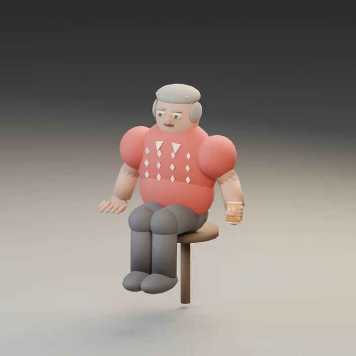
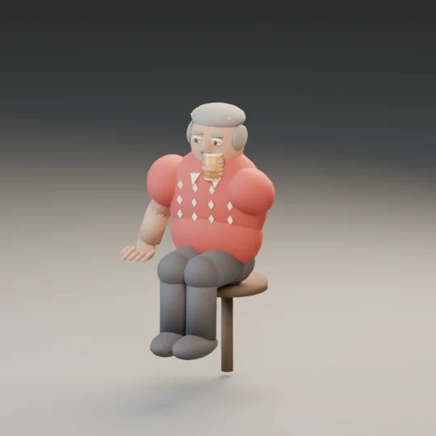
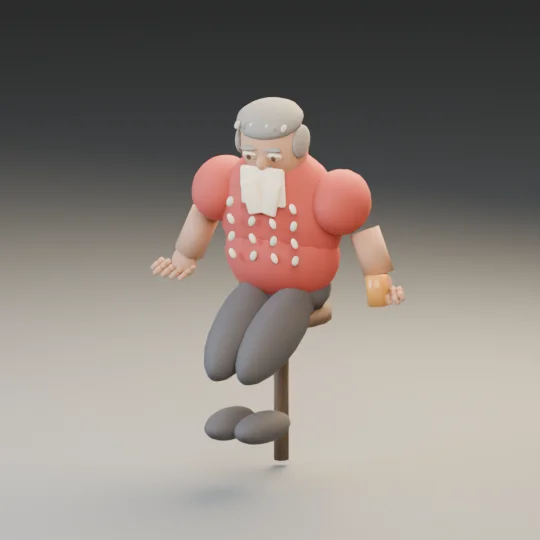

# Local validation — 1 October 2026

PR #111 was reapplied without conflicts to main `3557d778124b45746c2ae7cc7ee7af7ccc9f3516`, a descendant of the requested `019bc9a2e51f90904e1e1dc0c11be0b8d04abcae`. All original three files were absent from main. No live source, model manifest, save keys, schedule or runtime bundle was changed.

**Decision: retain draft; do not integrate this model.** Successful generation closes the old Blender dependency gap, but does not make the asset production-ready.

## Repairs and verified checks

- Executed locally with Blender Python `bpy` 4.2.0. Fixed four missing armature arguments that previously stopped generation; switched the preview to CPU Cycles for headless rendering.
- Corrected the audit to examine each eye on its own side, require both eye meshes and check actual nonzero vertex weights rather than vertex-group names alone.
- Corrected NLA track names so the GLB exports `Barfly_Drink_Loop` and `Barfly_Sleep_Loop`; removed unnecessary 100-fold review-strip repetition.
- Built editable Blender source, PNG preview, skinned GLB and passing rig audit. GLB: 763,928 bytes, 9,001 exported vertices, 115 primitives/skinned meshes, 51 bones.
- All 28 finger chains retain effective GLB weights. Individually rotating each finger in Blender moves its weighted geometry; see `review/deformation-review.json`.
- Smile, Frown, JawOpen and left/right Blink targets have nonzero deltas in Blender and in the exported GLB (including sparse accessors). Both eye pairs have their correct blink targets. Control presence and motion are verified; clean facial expression appearance is not approved.
- Both clips survive export, with 153 channels and duration approximately 1.042 seconds each.
- The town's bundled Three.js GLTFLoader parses the GLB. Its AnimationMixer produces finite deformed vertices across seven samples at 02:59, 03:00, 09:59, 10:00, evening and midnight. The actual Minato guest attachment and venue service keep the actor in his existing seat, switch Drink/Sleep at the existing boundaries and never open a ledger or charge him. See `review/runtime-review.json`.
- Four new export-audit regressions pass, including rejection of zero finger weights, inert morphs and incorrect clip names.

## Failed acceptance gates







- The drink hand/glass remains at waist level: the nearest glass vertex is approximately **0.598 m from the mouth** at the drink pose. The glass is an opaque amber cylinder; it lacks a convincing rim and grip.
- Both clips interpolate from an upright/rest pose to a brief seated pose and back every 1.042 seconds. The sleep pose keeps the eyes open and returns upright; it is unsuitable for continuous overnight sleep.
- Legs are single rigid thigh-weighted forms, with shoes on separate foot bones; the seated preview exposes floating feet and gaps. Floor-to-shoe clearance alone is not a failure for a high stool, but this geometry does not establish clean knee/shin deformation or seat contact.
- The oversized cream collar overlaps the shirt, the leaf print appears as raised buttons and the hair details protrude. These render observations do not meet the requested visual standard.
- There are 115 separate single-primitive skinned meshes. That is a substantial draw-call risk for one phone actor; no measured WebGL frame-rate or renderer call comparison is claimed. Consolidation and material reduction are required before performance approval.
- The runtime neutral height measured at a drink sample is approximately 1.737 m; the source's nominal 1.72 m is not an exact measured height.

## Browser and existing test limitations

The isolated browser harness was attempted with local Playwright Chromium at desktop 1280 and phone 390 widths. Chromium aborted before creating a page: `process_singleton_posix.cc: socket() failed: Operation not permitted`. **No WebGL render, phone frame-rate measurement or browser screenshot passed.** `review_browser.mjs` is retained for a permitted browser environment. CPU loading is not a substitute for this gate.

The four existing focused files (`living-town`, `resident-life`, `meal-motion`, `izakaya-beer`) yielded **19 passing / 1 failing** tests. The failure is `resident-life`: `room.getObjectByName('resident-prop-beer')` is absent after the finished meal. It reproduces in a separate, unchanged `3557d778` main worktree. The Barfly's permanent seat, free beer and overnight sleep tests pass. This PR does not change the unrelated service test or service implementation.

## Reproduction

From the repository root:

```sh
blender --background --factory-startup --python johansson-town/art/characters/minato-barfly/build_barfly.py -- --output /tmp/barfly
blender --background --factory-startup --python johansson-town/art/characters/minato-barfly/inspect_barfly.py -- --output /tmp/barfly
node johansson-town/art/characters/minato-barfly/validate_glb.mjs /tmp/barfly/minato-barfly.glb
node johansson-town/art/characters/minato-barfly/review_runtime.mjs /tmp/barfly
node --test johansson-town/tests/barfly-asset-validation.test.mjs
# Requires Playwright, CODEX_PRIMARY_RUNTIME_NODE_MODULES and a permitted Chromium executable:
TOWN_CHROMIUM_PATH=/path/to/chrome node johansson-town/art/characters/minato-barfly/review_browser.mjs /tmp/barfly
```

For a Python bpy installation, replace the Blender command prefix with its Python executable and retain the script path and `-- --output` arguments. The review JSON and images are committed as evidence; the rejected GLB is reproducible and is not shipped to visitors. Actions now runs the deformation, export and CPU runtime checks and uploads their outputs when a runner is available. Visual approval remains manual.
