# Johansson Town: amplify audit

1 October 2026. Read-only audit of the live peninsula town, plus research and a standard to build to.
The screenshots were taken from the running game (`?audit`, headless Chromium with SwiftShader, 12:00 requested,
so the light reads late afternoon) and are in `docs/amplify-audit/`.

## The pitch, in one line

**An adult island life-sim:** the social drama of Tomodachi Life, the collecting and home-making of Animal Crossing,
and Shenmue's walkable, talk-to-everyone town with a mystery and a part-time job. It is set in one Okinawan harbour
town in 1997 and drawn as a chunky, cel-shaded toy diorama.

The town already has most of Shenmue's bones: a real clock, shop hours, schedules, a ferry, an izakaya, vending
machines, magazines and a dungeon. It also has the start of a Tomodachi cast. **Everyone is already an avatar.**
What it lacks is one visual language and the systems that make residents *want* things from you and from each other.

| | |
|---|---|
| 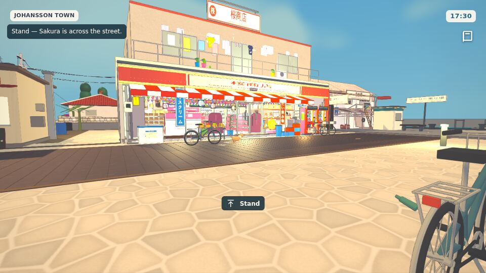 | 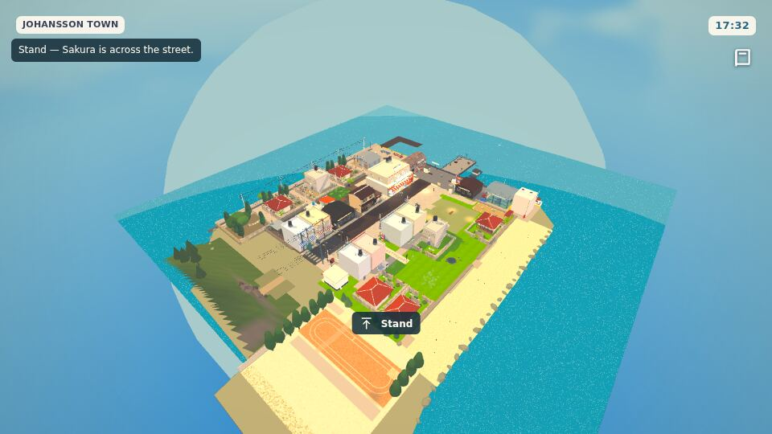 |
| 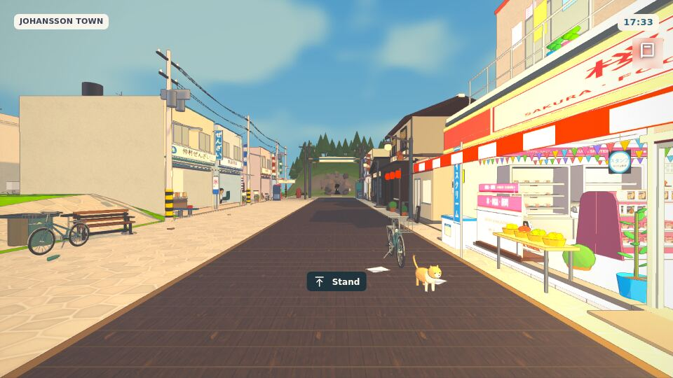 | 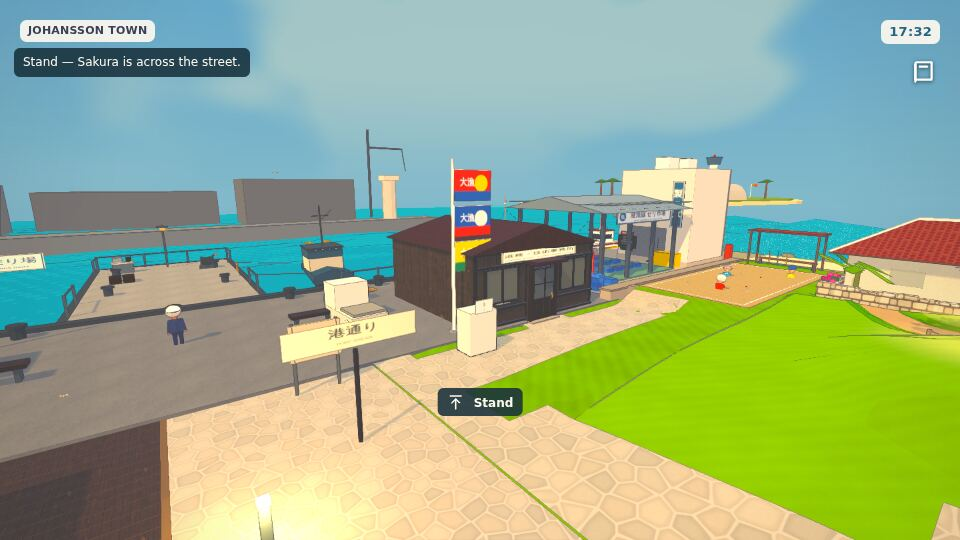 |
| 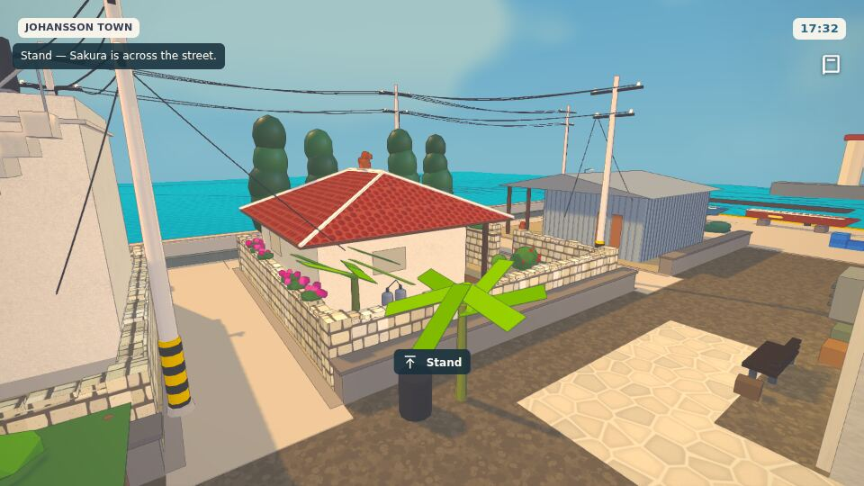 | 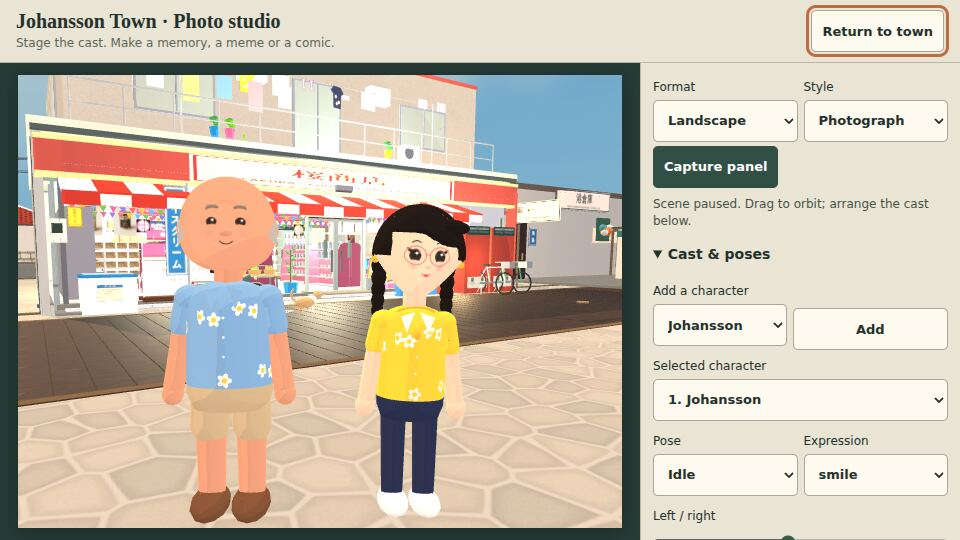 |

## 1. What the screenshots show

1. **Two renderers in one frame.** Props and people are toon-shaded. Walls, roofs and frontages are physically based
   (PBR) and lit by an HDR environment. Sakura's plaster, the bookshop timber and the harbour office roof are glossy and
   photographic, while the kōban, school and onsen are flat toon. This is the biggest single reason the town looks
   unfinished.
2. **The ground is the loudest thing on screen.** The orange cell paving is overscaled (cells about 1.5 m across) and
   reads as a giraffe pattern. The asphalt is a dark glossy plank texture. Grass is a flat acid green with no
   value steps. A Japanese street of the 1990s was grey asphalt with white edge lines and drain covers, and painted
   concrete kerbs.
3. **Sakura is out of scale and out of period.** It is a 14 m glass front under a fascia band with bunting, floating
   posters and a hand-written sign stack. That reads as a 2020s pop-up shop, not a 1997 island konbini or a
   mom-and-pop *shōten*. It dominates every opening shot.
4. **Mixed architectural languages.**
   - The Okinawan kit (red-tile houses, concrete shop-houses with tanks, poles and wires) is the best thing in the
     town. The Nishi-machi shot is close to the target already.
   - The cedar-gable bookshop, the grey-tile harbour office, the Sketchfab warehouse and the Sketchfab park sit beside
     it in different styles.
   - The flat cream-coloured slabs on the main street have no windows, signs or weathering.
5. **The world edge is visible.** The aerial view shows a square sea plane and a half-transparent sky dome. A frame
   of reef, tetrapods and haze on islands would hide it.
6. **Characters are charming but under-built.**
   - Head, face and colours work at a distance.
   - The bodies are capsules, the hands are spheres and the hair is a single deformed cap.
   - Avatars have no outline, so they float against inked scenery. In the cast shot the bald head merges with the
     background, and the skin goes salmon-orange under the warm grade.

## 2. Audit findings, ranked

### A. Rendering (blocks "gorgeous")

| # | Finding | Where | Fix |
|---|---|---|---|
| A1 | All architecture is tagged `keepPhysical` and skipped by the cel pass. The same applies to frontages, exterior details, the kit's textured/metal/gloss finishes, the dungeon and Sakura's interior. | `src/render/materials.js:43`, `frontage-material.js:16`, `exterior-details.js:16`, `okinawa/kit.js:192`, `cel.js:214-221` | One toon material family for everything except glass and emissives (see §4). |
| A2 | Photo textures from Poly Haven and OpenGameArt (plaster, timber, roof tiles, asphalt, concrete, bamboo) are only partly flattened (`FLATTEN=0.65`). | `cel.js:66-105`, `materials.js` | Painted, low-contrast detail maps at a fixed 1 m texel scale. Drop normal, ARM and AO maps. |
| A3 | Outlines are a depth-only screen pass. They miss creases, colour boundaries and avatars (faces, hair edge). The inverted-hull code is disabled (`if(false&&outline)`). Line width scales with supersampling. | `ink-pipeline.js:50-91,250`, `game.js:104` | Add a normal buffer and object IDs to the ink pass, fix line width in output pixels, and give avatars an inverted hull. |
| A4 | No tone curve: `NoToneMapping` plus a sun up to 3.47 lets bright plaster clip to white. `setTime` resets the grade lift to .032 and overwrites warmth, so `INK_OPTIONS` never applies. | `game.js:154,964-966` | A filmic shoulder before the grade, and one grade table per time of day. |
| A5 | The four-light rig (sun, bounce, violet up-light, hemisphere) quantises into extra bands. Soft PCF shadows put grey gradients inside hard bands. | `game.js:89,229-235` | One key light through the ramp, flat ambient outside it, and a hard-stepped shadow factor. |
| A6 | The sea and sky ignore the clock. The sea stays tropical cyan at night, and the dusk sky is a multiplied blue that turns muddy. | `world/ocean.js:128-137`, `render/sky.js` | Drive both from the `dusk.js` palette. Make the sky a gradient shader with painted cloud cards. |
| A7 | 372 `MeshStandardMaterial` call sites, each with ad-hoc hex colours. There is no palette. | repo-wide | A 256×1 palette texture with named swatches (§4.2). |
| A8 | Draw calls are about 575–660 at the start view (CPU estimate). No GPU or frame-rate figures exist. | `docs/art-pass-measurements.json`, `docs/harbour-batching.md` | The palette atlas lets buildings merge per 32 m cell. Measure on the iPad before and after. |

### B. Buildings (blocks "standardised")

| # | Finding | Fix |
|---|---|---|
| B1 | Four construction methods: the Okinawan kit (`okinawa/kit.js`), about seven ad-hoc builders each with its own `box()` helper (storefront, west-shops, harbour-office, kōban, yard-homes, ferry, harbour), Blender-script GLBs (school, onsen, Minato interior), and third-party photo GLBs (warehouse, park, Sakura interior, office interior). | Everything outside goes through the kit, and the kit gains a grid (§5). |
| B2 | No module grid. Storeys are 2.7, 2.8, 2.85, 3.05, 3.1, 3.15, 3.3, 3.45 and 3.9 m. Door widths are 0.95, 1.4, 1.45, 1.5, 1.6 and 1.9 m. Door heights are 2.0, 2.1, 2.25 and 2.4 m. Windows are ad hoc. | The 0.91 m *hankan* grid in §5.1. |
| B3 | Off-style buildings: the cedar gable bookshop (mainland or alpine), the PBR harbour office, the Sketchfab warehouse, the 14 m glass Sakura, and the Sketchfab park. | Rebuild each as a kit archetype (§5.4). |
| B4 | Every resident home without its own room gets the same `buildResidentHome` shell (`game.js:657`). | Room kit plus a per-resident furniture recipe (this is also the Tomodachi apartment view). |
| B5 | **Licence risk, live:** the harbour office interior is a ripped *Tomodachi Life* (Nintendo) room. A third-party Sketchfab upload labels it CC-BY, but an uploader cannot license Nintendo's assets (`assets/models/office/manifest.json`). The Sakura interior GLB has no licence on record (`assets/models/sakura-interior/source.json`). The Crystal room (also Tomodachi), the Shenmue ramen and the Seinfeld apartment are legacy-only but still shipped. | Replace the office and Sakura interiors with kit rooms first. Remove the legacy rips from `assets/`. |

### C. Characters (blocks "polished")

Every person in the 3D town is a Shimanchu avatar (`src/avatars/`). That includes the player, 25 recipes in `cast.js`,
residents generated from their names, the classroom, the onsen, the photo studio and the dungeon costumes. That is the
right foundation. The gaps:

| # | Finding | Where |
|---|---|---|
| C1 | No age axis: children are 1.38–1.41 m and adults 1.40–1.68 m. Counters need a 0.2 m `COUNTER_STEP` because the town was built for real people. | `build.js:28`, `actors.js:32` |
| C2 | Hands are spheres and shoes are ellipsoids, so waving, pointing, holding and eating read poorly. | `build.js:422,434` |
| C3 | Hair is one deformed sphere cap (64×44 segments, the bulk of the 6–15k triangles per body). There are no locks and no silhouette. | `build.js:141-250` |
| C4 | Wardrobe: 7 tops, 4 bottoms and 3 prints. Shoes are a colour only. No school uniforms, salaryman suit, office vest, jinbei, happi, tracksuit, coveralls, rubber boots, sun hat with neck flap, or towel round the neck. Name-generated residents all end up in a polo or blouse with trousers. | `recipe.js`, `cast.js:122` |
| C5 | No avatar outline. The face lines are in the texture, but the head/hair edge never inks. | `face.js`, `ink-pipeline.js` |
| C6 | The creator, the guide portraits (`assets/images/residents/*.webp`) and the town each light avatars differently. The portraits are pre-rendered and go stale when a recipe changes. | `creator.js:230`, `tools/render-resident-guide.mjs` |
| C7 | Not yet avatars: the 10 MB PBR `thuans-storage/models/thuan.glb`; Tama the cat and the crabs (one-off spheres and cones); costume hoods (separate meshes); fallback capsule mascots. | `thuans-storage/src/character.js`, `world/harbour.js:305`, `dungeon/costumes.js:42` |
| C8 | Identity drift: Mrs Higa and Grandmother Higa are two recipes. Hana and Daichi have an adult street look and a pupil look. | `cast.js`, `school-avatars.js` |

### D. Coherence

- **Which year?** `town-clock.js` says 1997 (`TOWN_YEAR`), as do the README, the map (平成九年) and the guide.
  `SESSION-PURPOSE.md`, `ART_DIRECTION.md`, the workbook doc, the save key `johansson-town-1988-v5` and the Star Port
  cabinet say 1988. The day is 13 September in one place and 14 in another. **Recommend 1997.** It fits Okinawa
  better: Coco! konbini, pagers and PHS phones, Tamagotchi (1996–97), the Purikura boom, Orion and Blue Seal at
  their most local, and the US bases at the centre of local politics after 1995.
- `town-absence.js:1` still describes the old one-second-per-minute clock.
- `ART_DIRECTION.md` still endorses the HDR environment, and `DUSK.md` says the opposite. This audit supersedes both
  on look and feel.

## 3. Research: a small Okinawan harbour town, 1997

Condensed from a sourced brief (sources at the end). *Observational* items are well-known period detail that was not
checked against a source.

**What dominates the skyline in 1997.** About 90% of Okinawan buildings are concrete. After the war, block machines
arrived with US base construction, and concrete beat typhoons and salt. So the hero shape is:

- a **low, rounded, cream-to-grey reinforced-concrete box** with a parapet;
- a **rooftop water tank** on a steel stand, either a matte black FRP tank or a silver stainless cylinder (about 80%
  of homes had one after the droughts);
- **rebar stubs** left for the next storey, an outside stair to the roof, and laundry;
- **hana-burokku** breeze-block screens (rings, crosses, petals);
- **black mould streaks** under every parapet and **rust drips** under every fitting.

**The old layer.**

- Low hipped **akagawara** red-tile roofs with thick white *shikkui* plaster bands, and **shisa** on the ridge or the
  gateposts.
- **Ishigaki** coral-stone walls at chest height, a **hinpun** screen inside the gate, and dense **fukugi** windbreak
  trees.
- Tsuboya in Naha and Bise in Motobu are the clearest surviving examples.

**The street layer.** This is the strongest "Japan" signal:

- concrete utility poles with sagging bundles of wires, transformers, step pegs and yellow-black sleeves;
- round-top vermilion post boxes;
- green card phones, with a pink 10-yen phone as the old-fashioned one;
- banks of two or three vending machines that light the street at night;
- orange-pole convex mirrors, white kei trucks (Carry, Sambar) and red Super Cubs with a delivery box;
- mamachari bicycles;
- tetrapods, bollards, styrofoam fish boxes, green and orange nets, and FRP boats with a white wheelhouse.

**Island specifics.**

- **Coco! (Cocostore)**, an Okinawan konbini chain from 1971, is the right model for Sakura's neighbour. It was absorbed
  by FamilyMart in 2016, so it is correct for 1997.
- A&W (1963) with root beer in frosted mugs, and **Blue Seal** ice cream.
- Orion beer enamel signs, sanshin from a shop radio, and eisa drums at Obon.
- **"730"**: left-hand traffic since 30 July 1978.
- Koza-style **A-sign** bar plaques and English neon.
- *(observational)* Y-plate US cars.

**Colour and light.**

| Swatch | Approximate value |
|---|---|
| Shallow reef sea | #3EC6C0 |
| Deep sea | #1E4F9A |
| Warm concrete | #B8B2A6 |
| Terracotta tile | #B5452E |
| Shikkui white | #F4F1E8 |
| Fukugi green | #2F5A3A |
| Hibiscus | #D8344A |
| Bougainvillea | #C2347E |

- **Light:** hard, short midday shadows; very bright bounce off the white coral roads; long golden evenings; haze on
  the outer islands; sodium lamps, vending machines and snack-bar box signs at night.
- **Age:** old signs fade toward cyan as the reds go first. Make that a global rule.

**What the stylised references teach.**

- **Wind Waker:** readability is the reason for the style.
- **Animal Crossing: New Horizons:** chunky soft forms with tactile material hints. Grass tufts were cut because they
  hid objects.
- **Boku no Natsuyasumi:** simple 3D people against lovingly painted, time-of-day-keyed backdrops. The nostalgia is in
  the light.
- **Sable:** a planned palette and line weight per time of day.
- **Guilty Gear Xrd:** inverted hull with per-vertex width, and hand-edited normals for shadow shape.
- **Genshin:** SDF face-shadow maps.
- **Hi-Fi Rush:** toon-shade the *whole world* through one path.
- **Tchia:** condense a real archipelago's essence rather than map it.
- **Shenmue (Dobuita):** composite real streets, and density of small things to touch.

## 4. The look: one material, one palette, one line

### 4.1 Material

A single `TownToon` material, MeshToonMaterial patched through `onBeforeCompile`, is used by every mesh that is not
glass or an emissive.

- **Ramp:** 3 steps, lit 1.0 / half 0.72 / shadow 0.48, hard terminator. Pale masses (plaster, shikkui) use the
  `soft3` variant so white walls keep a light shadow.
- **Shadow** = darkest band, tinted by the time-of-day `shadowTint`. The shadow-map factor is `step()`ped, never
  soft.
- **Rim:** `step(0.6, 1−N·V)`, strength 0.25, in `rimColor` from the palette. It separates people from walls.
- **Specular:** stepped, and only on metal, wet ground, glass and hair (one highlight band).
- **Albedo:** a palette index (vertex attribute) plus an optional painted detail map at 1 m per repeat, such as tile
  joints, block holes, wood grain or grime. No normal, roughness or AO maps. No `scene.environment`.
- **Weathering** is shared decals and trim: mould streaks under parapets, rust under fittings, sun-fade on signage.

### 4.2 Palette

A 256×1 texture with named swatches in one module (`src/render/palette.js`). Each building picks one wall colour,
one trim and one accent. The research swatches above are the base. Every hex in world code becomes a name. Saturation
is capped at about 70% except signs, flowers and the sea.

### 4.3 Line

- **Environment:** the screen-space ink pass gains a normal buffer (creases) and an object-ID buffer (silhouettes
  between touching meshes). Width is about 1.5 px at 1080p, independent of supersampling, and fades past 60 m.
- **Avatars and hero props:** inverted hull, 1.2–2 px, coloured as a darkened albedo rather than black.

### 4.4 Light and colour script

One key directional light through the ramp, plus flat ambient outside it. Each key below gives sky, sea, key and
shadow values, blended by the clock in `dusk.js`.

| Key | Hours | Key light | Shadow | Sky / sea |
|---|---|---|---|---|
| Morning | 06–09 | pale peach | mint | milky blue / pale jade |
| Day | 09–16 | warm white | lilac | hard cyan with cumulus / reef turquoise |
| Golden | 16–18:30 | apricot | violet | gold horizon / green-gold |
| Blue hour | 18:30–20 | magenta | indigo | lanterns, vending machines and shop signs on |
| Night | 20–06 | moon blue at 0.25 | navy | stars; emissives carry the scene |
| Rain or typhoon | any | grey-teal | slate | yellow-green typhoon light |

The sky becomes a gradient shader (zenith, horizon, sun glow) with 2–3 layers of painted cloud cards. A horizon frame
of reef, tetrapods and hazy islands hides the square sea edge.

## 5. Building standard: the Okinawa '97 kit

Extend `src/world/okinawa/kit.js`. It already bakes by finish and cell with vertex colour. Add a `GRID` and archetype
builders.

### 5.1 Grid

| Module | Value |
|---|---|
| Grid unit | 0.91 m (半間); bay 1.82 m (1 ken); breeze block 0.30 m (3 per unit) |
| Storey | 3.0 m shop ground floor, 2.7 m residential and upper floors; slab 0.15 m; parapet 0.6 m |
| Raised timber floor | 0.45 m (old houses only) |
| Doors | 0.91 × 2.0 m domestic; 1.82 × 2.1 m sliding shop pair; 2.73 m roll-shutter bay with a 0.3 m box |
| Windows | 0.91 m and 1.82 m aluminium sliders; sill 0.9 m, head 2.1 m |
| Eaves | 0.6 m tile hip; 0.9 m shop canopy; 0.3 m concrete slab hood over windows |

These are toy-scaled for the avatars: kit dimensions × 0.92, so avatars of 1.45–1.65 m fit counters without
`COUNTER_STEP`.

### 5.2 Roof families

- **R1 akagawara hip:** about 22°, white shikkui ridges, shisa.
- **R2 flat RC:** parapet, black or silver tank on a stand, rebar stubs, TV aerial, outside stair.
- **R3 corrugated tin:** gable or lean-to, for sheds, the auction hall, the bike shed and the warehouse.
- **R4 tiled gable:** only the onsen and Minato, as mainland-style exceptions.

### 5.3 Parts that snap to bay sockets

- **Wall sets:** plaster or painted block, hana-burokku, coral stone, and hinpun.
- **Front parts:** roll shutter, shop sash, fascia board (0.6–0.9 m × bay), vertical kanban (0.45 × 1.8 m), enamel
  plate, noren, awning, AC condenser, gas bottles, meter box, nameplate.
- **Street parts:** vending bank, post box, card phone, convex mirror, pole with transformer and wires (about 30 m
  spacing), drain covers, kerb, white edge line, bus stop, Coca-Cola bench.
- **Harbour parts:** tetrapod, bollard, float, fish box, net heap, FRP boat, gangi steps.

### 5.4 Mapping today's town onto the kit

| Now | Becomes |
|---|---|
| Kit shop-houses, Thuan's flat, the cream slabs | R2 shop-house, 7 bays; ground floor 3.3 → 3.0 m; give the slabs windows, signs and weathering |
| Sakura (14 m glass) | R2 corner *shōten* at 8 bays with a period fascia, two vending machines and an ice-cream freezer outside |
| Front-Row bookshop (cedar gable) | R2 shop-house pair: books on the left, workshop behind the shutter on the right |
| Harbour office (PBR gable) | R2 harbour co-op office with a tank and a radio mast |
| Warehouse (Sketchfab) | R3 tin warehouse in the kit |
| Park (Sketchfab) | Kit park: gateball, banyan, a concrete slide, and a shelter with an R1 roof |
| Red-tile and concrete houses, yard homes, kōban | Snap to the grid; keep the designs |
| School | Regenerate from the palette (already R2) |
| Minato, onsen | Keep forms (R4); align doors and eaves to the grid |
| Office interior (Tomodachi rip), Sakura interior (no licence) | Kit rooms |

## 6. Avatar standard: Shimanchu 2

| Rule | Spec |
|---|---|
| Age axis | `age`: child, teen, adult or elder. Height: child 1.05–1.20 m, teen 1.35–1.50, adult 1.45–1.65, elder 1.40–1.55 (stoop 4°). Head-to-height: child 0.38, adult 0.30. Leg share 0.42–0.48. |
| Hands | Mitten hand (palm plus thumb), 4 poses (open, fist, point, hold) switched by gesture. |
| Feet | 5 shoe shapes: sneaker, sandal, geta, rubber boot, pump. |
| Hair | Shell pieces (fringe, sides, back) per style instead of one cap, about 32×22 segments. Add period styles: punch perm, wolf cut, permed bob, Amuro-style long brown hair and kogal tan (1997), salaryman side-part, tied-back for older women. |
| Faces | Keep the canvas face. Add expressions: sweat-drop, sparkle, tears, steam, blush flash, a shock look with white eyes. Mouth shapes for talking. Emote cards over the head (♪ ! ? 💢 zzz 💡 ❤). |
| Wardrobe | Layered garment shapes, not colour swaps. Sailor uniform, gakuran, short-sleeve shirt and tie, office vest, kariyushi, jinbei, happi, tracksuit, yukata, tsunagi, haramaki, raincoat, fishing vest; bucket hat with neck flap, towel round the neck, randoseru, shoulder bag. |
| Line and light | Inverted hull outline; character ramp with a warm skin terminator; rim. The creator, the photo studio, the guide portraits and the town all use the same pipeline. Portraits regenerate from recipes in CI. |
| Budget | 4–6k triangles per body (hair and prints as decals). One skinned draw per avatar plus the head. |
| One identity | One recipe per person everywhere. Merge the two Higas. Hana and Daichi wear `pupilRecipe` on the street too. |
| Animals | A small "critter" recipe family (cat, dog, crab, heron, fish) on the same material and outline. |
| Thuan's Storage | Load the town's avatar builder and retire `thuan.glb`. |

## 7. Play: amplify the three pillars

| Pillar | Already there | Missing (in priority order) |
|---|---|---|
| **Tomodachi (adult)** | 22 residents with profiles, schedules, homes, a friend each, gossip; Thuan's moods and gifts; photo studio; Bizarro dungeon humour | A relationship graph (player↔resident affinity, resident↔resident friend, crush, dating, quarrel). Daily wants and problems shown as a bubble. Life events: confessions, break-ups, karaoke nights, weddings, move-ins. Dreams seen through a window at night. Gifts for everyone. |
| **Animal Crossing** | Real-time clock and 1997 calendar, a fishing timing game, litter pick-up, shop economy, 3D-print crafting | A **Town Book catalogue**: fish by season and hour, shells, cicadas and dragonflies, gachapon, cassettes. A **player flat** with grid furnishing (reuse `resident-home.js`). Seasons in the world: typhoon days, Obon eisa, New Year, sakura in late January. Letters through the post box. |
| **Shenmue** | Dense walkable town, talk to everyone, shop hours, an arcade game, vending machines, magazines, notebook, map, phone, ferry, drinking | A **chaptered mystery** with time-gated leads, growing out of the Tama, mirror and "Kings of Ben…" fragments. A **part-time job**: forklift or fish-box stacking at the harbour warehouse, 06:00–09:00, paid by performance. **Gachapon** and a cassette or record shop. More cabinets at Star Port. A daily weather forecast that changes schedules and fishing. |

**Top five to build first.** Each reuses something that exists.

1. **Relationship graph** in the save, ticked by `social.js` co-location. It turns the schedules into drama.
2. **Wants bubbles:** each day 1–3 residents need something (a snack, advice, a quarrel mediated, an item from Sakura).
   Rewards are affinity and yen.
3. **Universal gifts**, generalising `thuan-gifts.js` using the likes already in `resident-personalities.js`.
4. **Town Book catalogue and gachapon** on top of the vending and inventory code.
5. **Harbour shift job** at the warehouse, the Shenmue anchor and a reliable income.

Keep the tone adult rather than explicit: work, money, hangovers, crushes, gossip, rivalries, small-town politics,
the base, the typhoon, a karaoke grudge.

## 8. Roadmap with gates

Each phase ends with real screenshots at the same six camera positions used above, for side-by-side comparison
(`?audit` plus the `__JOHANSSON_AUDIT__.camera` views listed in the appendix).

| Phase | Scope | Gate |
|---|---|---|
| **0. Decisions and cleanup** (½ week) | Fix the year (1997) everywhere, including the save-key migration. Remove or replace the ripped office interior. Strip legacy rips from `assets/`. Fix the `setTime` grade override. | No franchise assets ship. Tests pass at the baseline failure list. |
| **1. Look-dev** (1–2 weeks) | `TownToon` plus palette; remove `keepPhysical` and `scene.environment`; tone shoulder; key-light rig; ink normals and IDs; avatar hull; sky and sea from the colour script; horizon frame; repaint the ground (asphalt, kerbs, white lines, drains, calmer paving, stepped grass). | All six views read as one renderer. No white clipping at noon. Draws ≤ today's. |
| **2. Kit** (2–3 weeks) | `GRID`, R1–R4, the snap parts, the weathering decals; rebuild Sakura, the bookshop, the harbour office and the warehouse; snap the rest. | Every exterior is built by the kit. Only the onsen and Minato use R4. |
| **3. Shimanchu 2** (2–3 weeks) | Age axis, hands, hair shells, shoes, wardrobe ×15, emotes, outline; creator and portraits on the town pipeline; critters; Thuan's Storage on avatars. | Cast line-up screenshot: child, teen, adult and elder read at a glance. No non-avatar people anywhere. |
| **4. Life engine** (3–4 weeks) | Relationships, wants, gifts, life events, the Town Book catalogue, gachapon. | A 20-minute session produces at least one resident-to-resident event the player did not trigger. |
| **5. Island depth** | Harbour job, the mystery's first chapter, the player flat, seasons and weather, festivals. | — |

## 9. Decisions needed from you

1. **1997 or 1988?** I recommend 1997, the year the code and the guide already use.
2. **Toy scale:** shrink the world to the avatars (kit × 0.92) or grow the avatars? I recommend shrinking the world.
   It suits the diorama look and removes the counter step.
3. **The office interior** is a *Tomodachi Life* rip and should go. Do you want it replaced with a kit room first, or
   removed now?
4. **Sakura's identity:** a family *shōten* (warmer, more Tomodachi) or a Coco!-style chain konbini (more '97 Okinawa)?
5. **Camera:** the docs lock first person. Tomodachi and Animal Crossing are third person and character-led. I
   recommend third person as the default, with first person for shops and interiors.

## 10. Progress, 1 October 2026 (first build session)

Decisions taken, following the recommendations in §9: **1997**; **family *shōten*** for
Sakura (rebuild still to do); **third person outdoors, first person indoors**; the
ripped office removed and replaced; and **new buildings sized to the grid**. The world
has not been rescaled yet: the age axis fixed the worst scale mismatch (children) first.

| | |
|---|---|
| 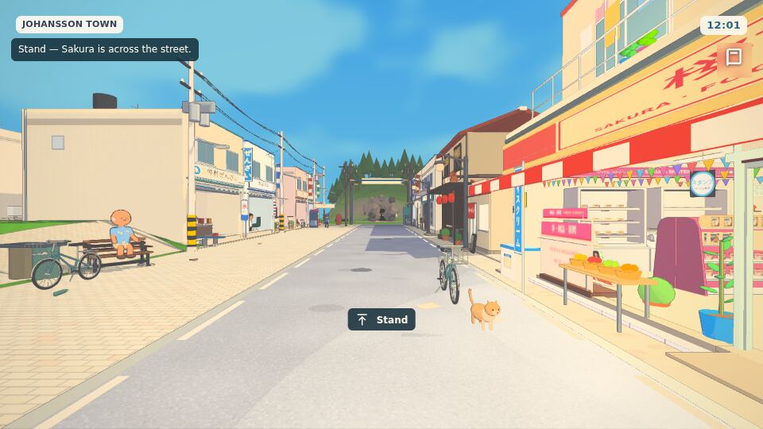 | 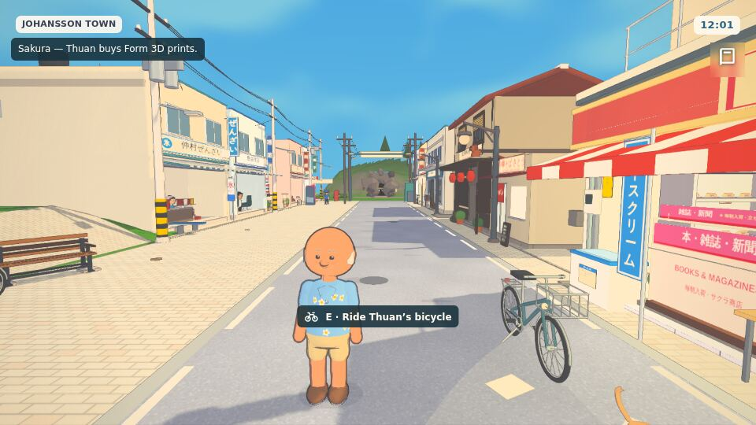 |
| 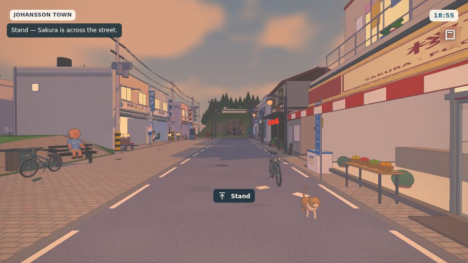 | 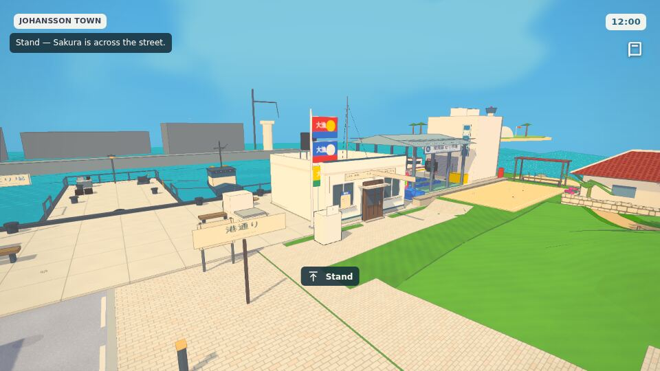 |
| 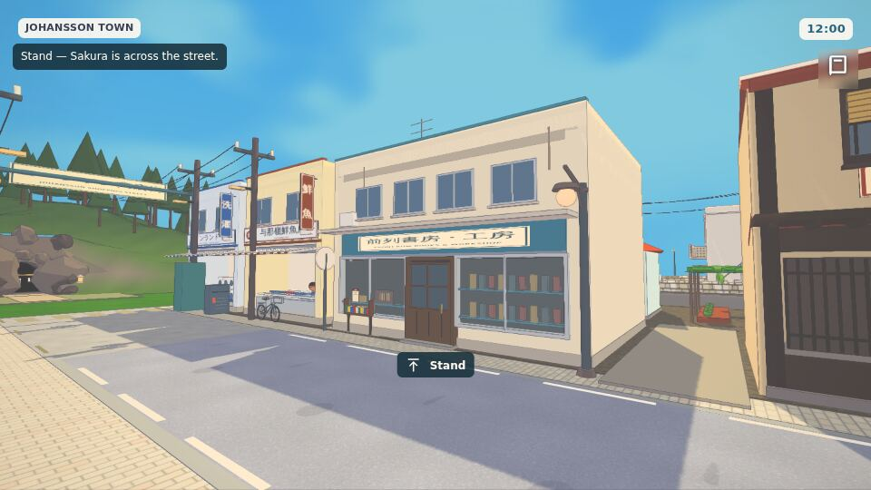 | 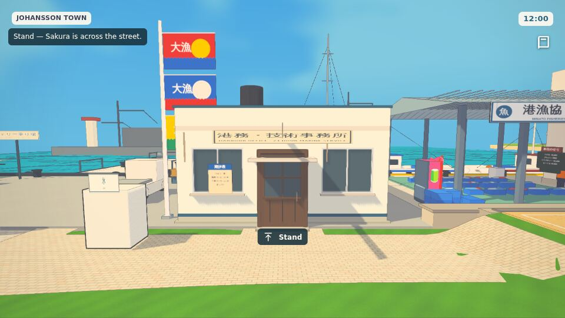 |
| 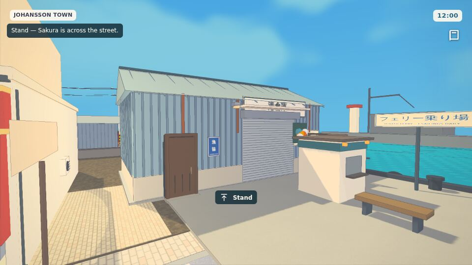 | 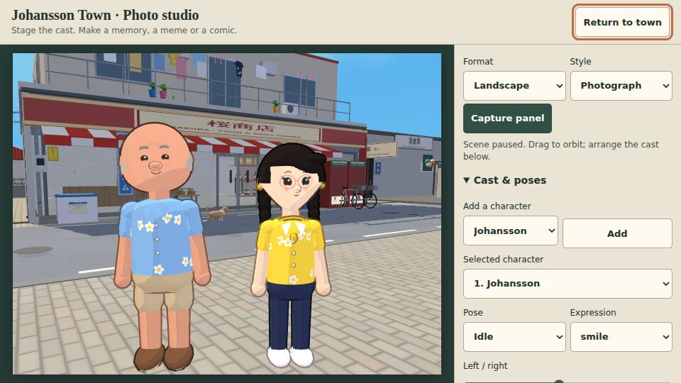 |
| 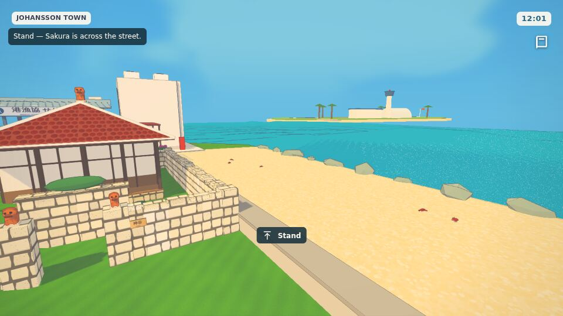 | 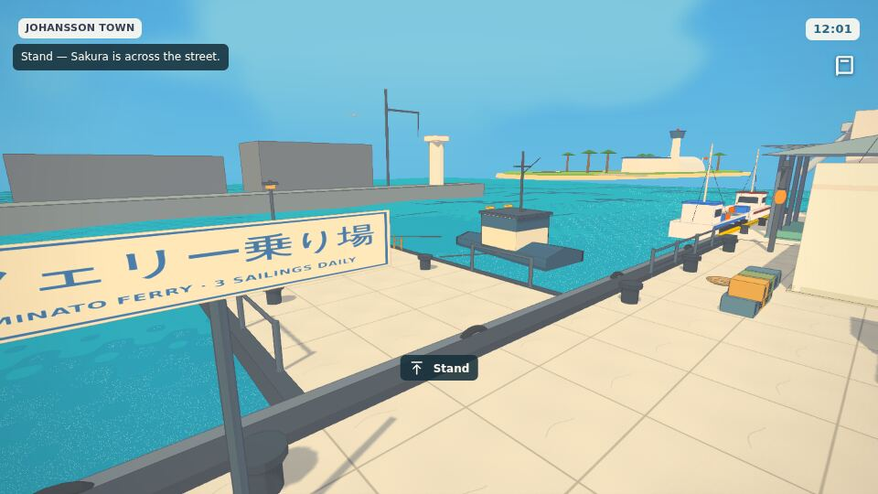 |

**Done**

| Audit item | What changed |
|---|---|
| A1, A2 two renderers, photo maps | Architecture joins the toon ramp. Photographed wall maps are kept only as faint grain (`ARCH_FLATTEN`). Only glass, the vertex-coloured Sakura interior, the dungeon and the legacy frontage atlas stay physically lit (`keepPhysicalStrict`). |
| A4 clipping, lift override | A highlight shoulder in the grade; the lift override fixed; saturation 1.15 → 1.08. |
| A5 soft shadows | `PCFShadowMap`, so shadow edges are hard. |
| A6 sea ignores the clock | `setOceanLight` blends day, dusk, night and rain sea colours from `duskClock`. |
| C5 no avatar outline | An inverted-hull ink shell on every body and head, tinted from the colour beneath. |
| C1 no age axis | `age`: child, teen, adult or elder sets height and head proportion. Profiles drive it. Pupils are 1.2 m. The creator has an Age choice. |
| B1–B3 off-style buildings | `GRID` in the kit. The bookshop, harbour office and warehouse are rebuilt as Okinawa '97 kit buildings. The warehouse no longer streams a 7 MB photo model. |
| B5 licences | The Tomodachi office and crystal room and the Shenmue ramen model are removed. |
| D year | Player-facing copy says 1997. Old docs are marked superseded. |
| §1.5 blank flanks | Shop-house side walls get drainpipes, stair windows, mould bands and painted adverts for invented brands. |
| Decision 5 camera | Third person by default. Rooms switch to first person and the street view returns at the door. |
| **Ground** (user request) | See below. |

**Ground coherence.** A raycast survey of the whole island on a 1.5 m grid found about
twenty ground treatments: four kit greys, a photographed quay concrete, three sands,
five coral whites and two paver tones. They were collapsed into seven families in
`src/render/ground-palette.js`:

| Family | Value | Where it is used |
|---|---|---|
| asphalt | #a9aeb4 | The main street (now a road, not a timber deck) and road boxes; painted, with edge lines, gutters and manholes |
| pavers | #c6c3ba | Footways and grid lanes; painted interlocking blocks |
| concrete | #b7b5ab | Quays, piers, village lanes and yards; painted 2 m bays |
| coral | #e2dac8 | Nishi-machi ground |
| sand | #e3d2a4 | Beach and gateball court |
| gravel | #a29e93 | West yard and grove |
| grass | #5c9848 | Lawns, park and open land |

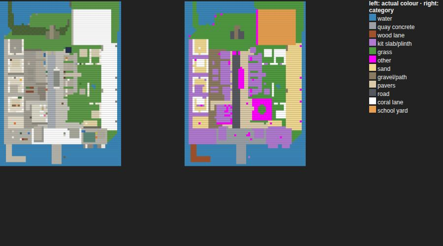

**Still to do, in order**

1. **Sakura.** Rebuild as an 8-bay family *shōten* on the kit (it is still the 14 m
   glass front). It is the hero shot, so do it with care.
2. **Night and interiors lighting pass.** Night is a grey haze rather than a scene lit
   by its signs. The classroom and office interiors are overexposed.
3. **The park model.** The Sketchfab park still loads; rebuild it from the kit.
4. **Horizon frame.** From the air you can see the square sea and the sky dome
   (reef, tetrapods, haze).
5. **Shimanchu 2, the rest.** Mitten hands, hair shells, shoes, the 1990s wardrobe and
   emotes. Then put Thuan's Storage on avatars and give critters the same material.
6. **Life engine** (§7): relationships, wants, gifts, the Town Book catalogue,
   gachapon, then the harbour job and the mystery.
7. **Sakura interior licence.** The supplied convenience-store GLB has no licence on
   record. Replace it with a kit room when Sakura is rebuilt.

## 11. Lessons from this session (self-audit)

These were caught by checking real screenshots after each change. They are worth keeping
as rules:

- **Rebuild the runtime before every commit that touches `src/`.** One commit went out
  with a stale bundle. `tests/runtime-package.test.mjs` catches it, so run it, or the
  full suite, before committing.
- **Screenshot at a fixed hour.** The first comparison ran at the real clock (17:47)
  and blamed golden-hour light on the materials. The capture script sets 12:00 before
  entering the town.
- **Probe before you fix.** The "khaki field" was not the land colour but the park's
  stand-in mound, and the "orange road" was a timber deck over the whole street.
  Raycasting the mesh under a pixel took a minute and saved a wrong fix.
- **Horizontal surfaces take full sun.** A green that looks right on a swatch blows out
  on the ground. Ground colours need to be darker than wall colours to read the same.
- **Vertex-coloured supplied models can go black under `MeshToonMaterial`.** Keep them
  physically lit with `keepPhysicalStrict` rather than forcing the ramp.
- **Tests encode old intent.** Several failures were the new direction working: two
  draws becoming four with outlines, kit plaster turning toon, the office no longer
  being a file. Update those tests to state the new rule; don't revert the change.
- **Budgets are part of the design.** The quarter's draw-call budget test caught the
  wall adverts; naming them as signs put them in the right category.
- **Third person needs room.** In a 3 m classroom the lens is mostly the back of a
  head. That is why rooms are seen first person.

## 12. Second build session: the island as a place people live

| | |
|---|---|
| 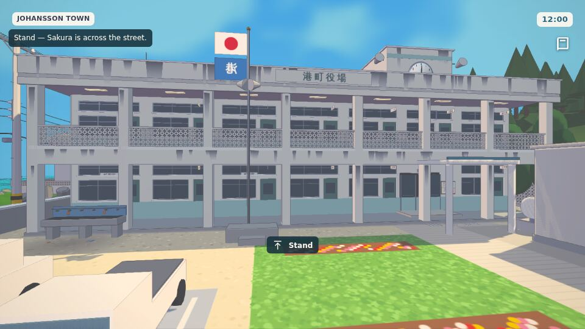 | 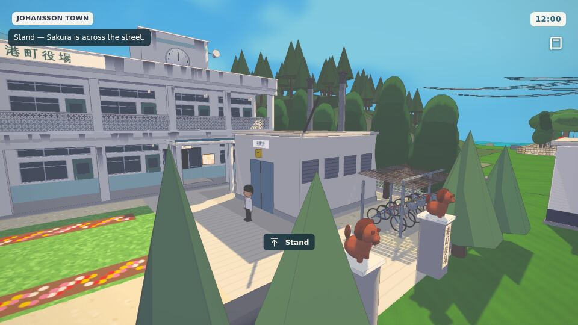 |
| 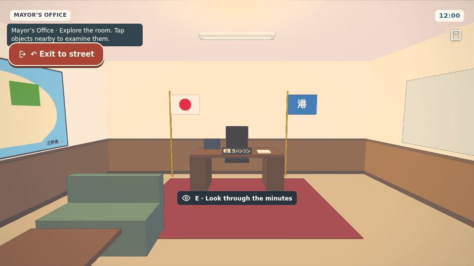 | 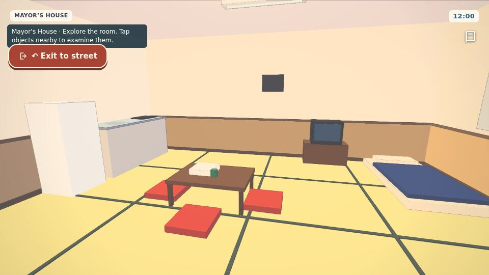 |
| 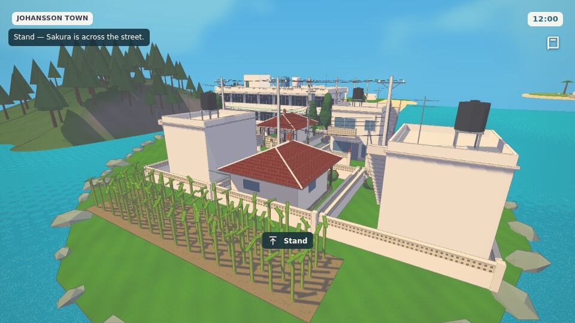 | 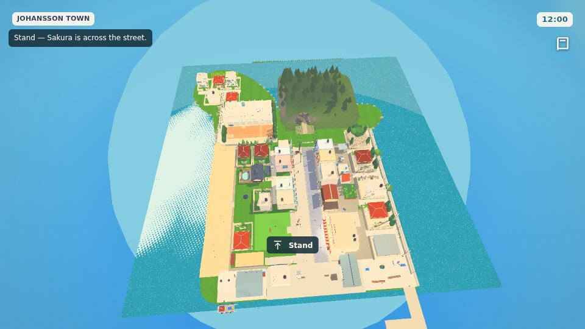 |
| 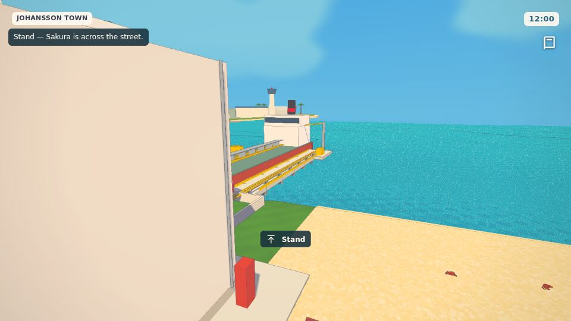 | 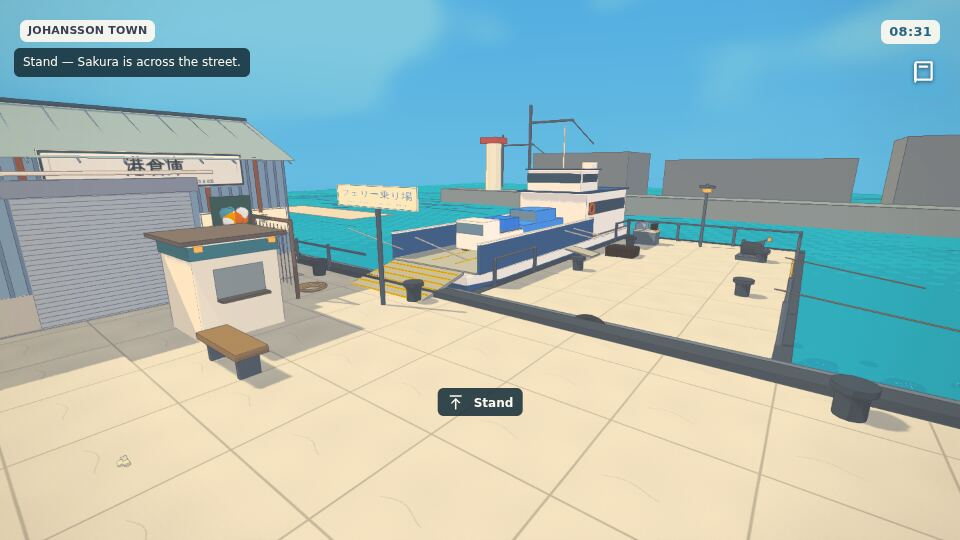 |
| 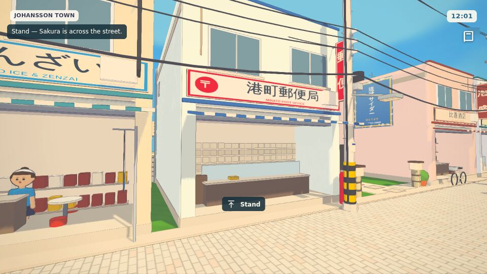 | 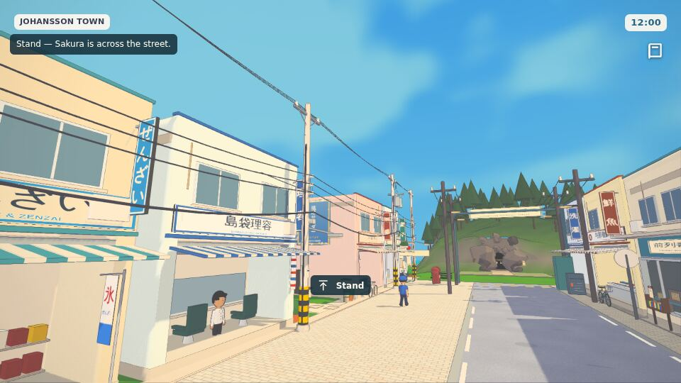 |
| 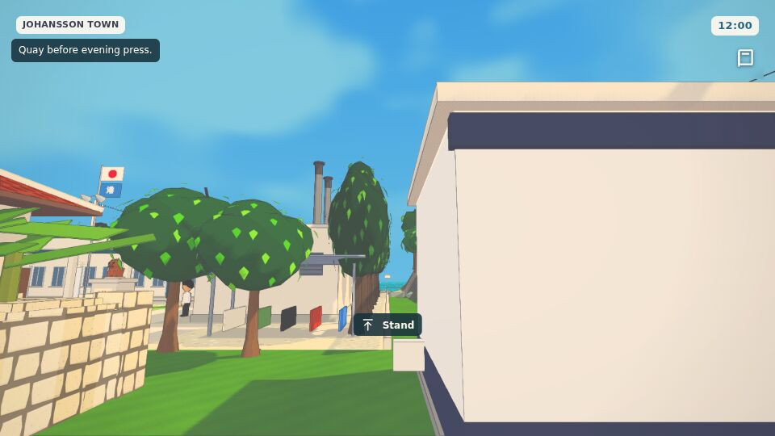 | 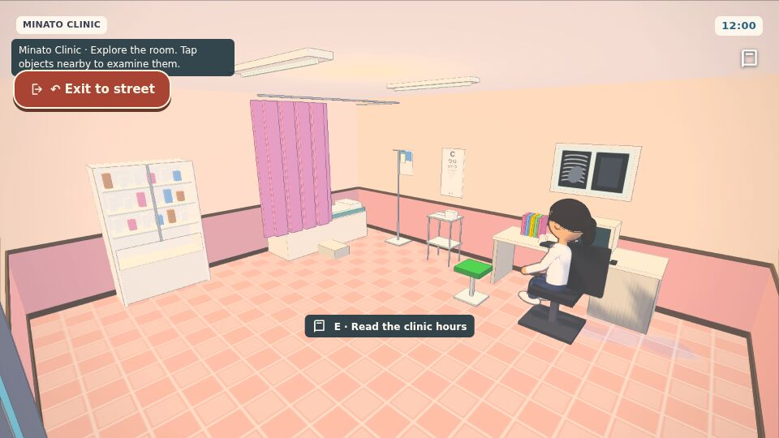 |

| Request | What was built | Where |
|---|---|---|
| Barber → generator | The barber became the power station; then, on request, the power house moved to the town hall grounds (its own louvred block, two stacks, day tank in a bund). The shop-house is now the post office. | `school.js` (`buildTownHallDressing`), `okinawa/quarters.js`, `houses.js` |
| School → town hall | 港町役場 · 公民館. The class is cut to 8 pupils, each from an island household. It has the mayor's office (petitions, minutes, island map) and Mayor Johansson's home (tatami, futon sleeps to 06:30, the wardrobe mirror opens the maker). The exterior gets a forecourt, canopy, lawn and beds, a car park with the town's vehicles, flags and a monument; the school-only props are cut from the model. | `interiors/town-hall.js`, `school.js`, `classroom.js` |
| Every NPC has a purpose and a home | `people/island-households.js` lists everyone, their home and their job, and nameplates read from it. Thuan, Nao and Mrs Sato live in Kitahama and walk home instead of taking the ferry. Families' houses have their own interior. | `island-households.js`, `kitahama-layout.js`, `island-homes.js`, `interiors/family-home.js` |
| Bigger, less rectangular island | An irregular natural shore around the built edges (seawall, harbour, beach), and new land to the north-east for Kitahama: five standard walled homes, block walls, a cane field and its pole line. | `peninsula.js`, `okinawa/quarters.js` |
| Car ferry | A ro-ro hull with the vehicle deck forward, the cabin and bridge aft, and a bow ramp that lands on the quay. On each call two vehicles drive off and up Main Street and two drive on; they wait for anyone in their path. | `ferry.js`, `ferry-vehicles.js` |
| Realistic utility poles | Spun-concrete distribution poles with a 6.6 kV crossarm, transformers and cutouts, low-voltage racks, telephone cable, step bolts and guy wires; conductors sag by type. | `okinawa/props.js` |
| Oil jetty and tanker | A walkable jetty on piles with a manifold, a hose crane and a pipeline to the shore fuel depot. The coastal tanker calls every third day, 08:00–15:00. | `oil-jetty.js` |
| Less clutter | Vending machines kept at three places (Sakura, the onsen lane, the fish quay). | `harbour.js`, `quarters.js` |
| Sewage works | Clarifiers, an aeration basin, a sludge tank and an outfall on Kitano-jima. | `airport-island.js` |
| Prettier trees | One shared broadleaf for the whole island: a trunk that flares into roots, and a crown of rounded lobes covered in leaf shingles over a dark core, with radial normals so the toon bands sweep across it as one mass. It comes in three forms: `round` (street and lawn trees), `column` (fukugi windbreaks) and `spread` (the banyan). It replaces every cone and sphere tree, including a light build for the headland. The uploaded Tomodachi tree was used as a style reference only. | `okinawa/trees.js`, `houses.js`, `school.js`, `east-lawn.js`, `forest-edge.js`, `coyote-tunnel.js` |
| Clinic | 診療所 in the town hall's old meeting-room bay, with its own door. Pink tiles, the couch behind a pink curtain, the drip stand, the desk with a beige monitor and an X-ray lightbox, the green patient stool, a glass medicine cabinet (habu antivenom underneath), a Landolt-ring eye chart, and scales by the door. Dr Kakazu is at her desk and is in the household registry. Built from scratch; the uploaded hospital model was a reference only. | `interiors/town-hall.js` (`buildClinic`), `school.js` |

**Still open:**
- The neighbours have homes and jobs in the registry, but they still keep to their spot rather than walking home at night. Doing that means turning them into scheduled residents.
- Sakura's rebuild, the night and interior lighting, the park model, the horizon frame, the rest of Shimanchu 2, and the life engine (§8) remain.
- The quarter's budget rose from 80 to 110 draws and from 120k to 150k triangles for Kitahama and the new poles. Measure on the iPad.

## Appendix: audit camera views

```js
// Run inside the ?audit page, after "Enter town".
const views = {
  aerial:      {pos:[60,70,60],      at:[0,0,-10]},
  harbour:     {pos:[0,6,-25],       at:[15,1,-45]},
  nishimachi:  {pos:[-18,5,-12],     at:[-32,1,-22]},
  mainStreet:  {pos:[-3.5,1.7,-30],  at:[-3.5,1.5,10]},
};
__JOHANSSON_AUDIT__.camera = views.harbour;
```

## Sources (research)

- Ryukyuan architecture: https://en.wikipedia.org/wiki/Ryukyuan_architecture ·
  https://www.visitokinawa.jp/about-okinawa/traditional-houses ·
  https://www.japan-experience.com/plan-your-trip/to-know/understanding-japan/traditional-okinawa-houses
- Concrete Okinawa: https://www.fastcompany.com/90734785/on-this-japanese-island-nearly-every-building-is-made-of-concrete ·
  https://medium.com/@shoko20231992/the-concrete-art-in-okinawa-c5239a7fcec3 ·
  https://www.okinawanderer.com/2016/06/hana-block-is-okinawas-original-wall-art/
- Water tanks: https://www.japantimes.co.jp/news/2000/07/21/national/once-needed-water-tanks-now-a-concern/
- 730: https://en.wikipedia.org/wiki/730_(transport) · A-sign: https://en.kozaweb.jp/featurePages/show/246
- Coco!: https://logos.fandom.com/wiki/Cocostore · http://www.japanupdate.com/2015/09/familymart-buys-cocostores/
- Blue Seal: https://www.kpbs.org/news/2016/12/08/blue-seal-the-gi-ice-cream-that-okinawans-made ·
  A&W: https://www.meniscuszine.com/articles/2019052547109/japans-first-aw-its-in-okinawa/
- Tsuboya: https://www.japan-guide.com/e/e7115.html · Ine no Funaya: https://www.kyototourism.org/en/sightseeing/530/ ·
  Tomonoura: https://sustainable.japantimes.com/satoyama/21
- Utility poles: https://japantoday.com/category/features/lifestyle/why-does-japan-have-so-many-overhead-power-lines ·
  post boxes: https://www.pix4japan.com/blog/20260102-postbox · phones:
  https://www.japan-experience.com/plan-your-trip/to-know/traveling-japan/public-telephones-in-japan
- Shenmue's Dobuita: https://shenmuedojo.com/media/sacred-spot-guide-map/
- Wind Waker: https://sourcegaming.info/2017/08/10/holism-the-wind-wakers-cel-shaded-graphics/ ·
  New Horizons: https://nookipedia.com/wiki/Prerelease_and_unused_content_in_New_Horizons ·
  Boku no Natsuyasumi: https://chsmc.org/2024/03/inaka-summer/
- Toon technique: https://gdcvault.com/play/1034330/3D-Toon-Rendering-in-Hi (Hi-Fi Rush) ·
  https://www.ggxrd.com/Motomura_Junya_GuiltyGearXrd.pdf (Guilty Gear Xrd) ·
  https://panthavma.com/articles/shading/toonshading/ ·
  https://blog.playstation.com/2021/08/05/crafting-a-tiny-open-world-a-look-behind-the-scenes-at-the-creation-of-a-short-hike/
- Tchia: https://www.unrealengine.com/developer-interviews/tchia-is-a-beautiful-ambitious-undertaking-from-a-small-indie-studio
