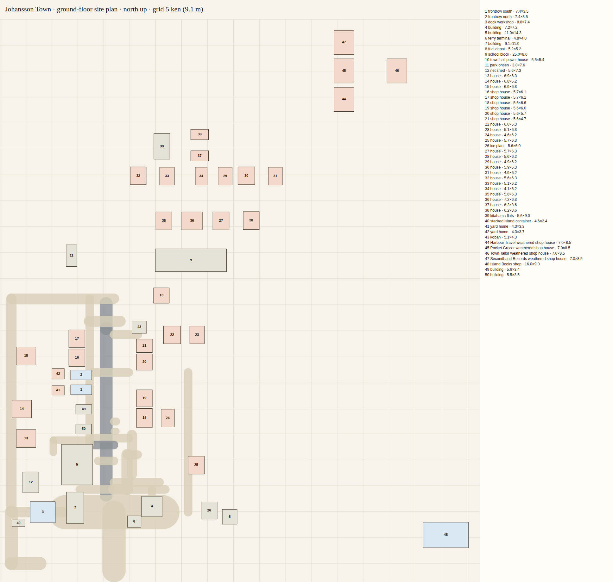
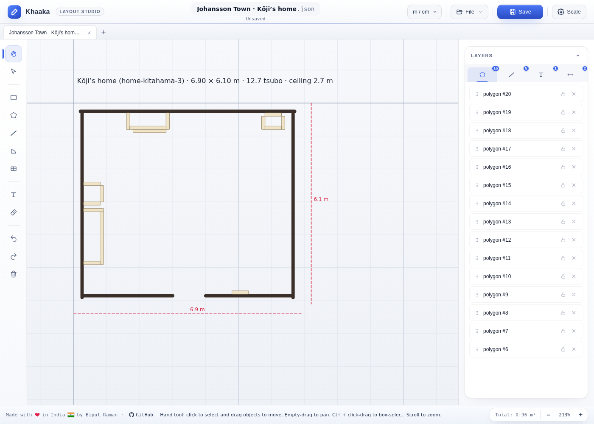
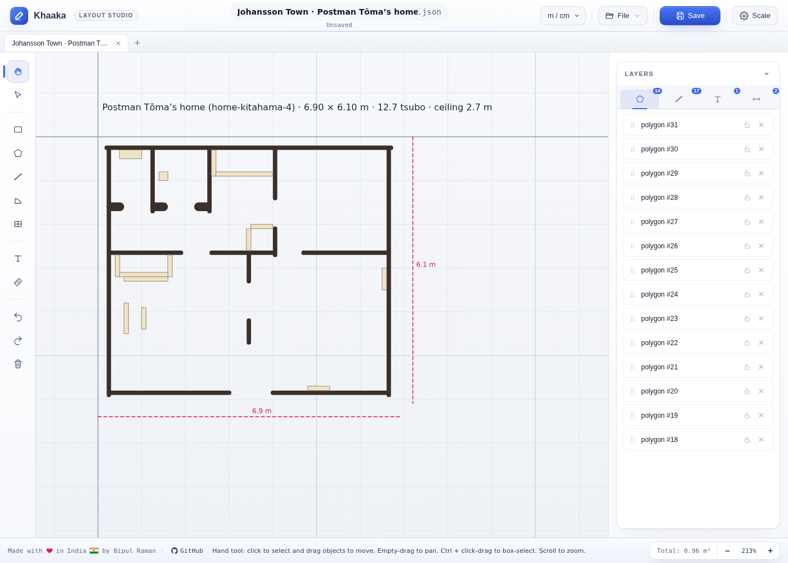
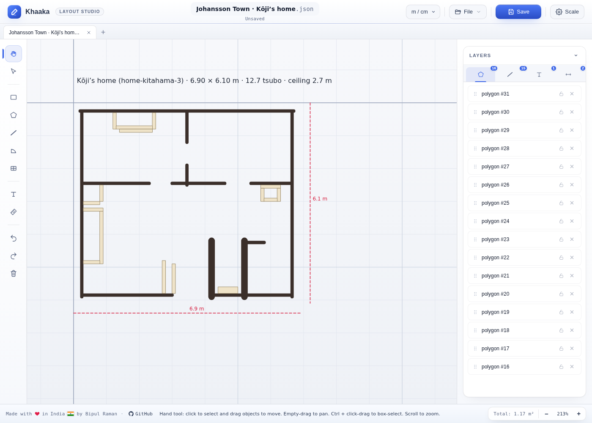
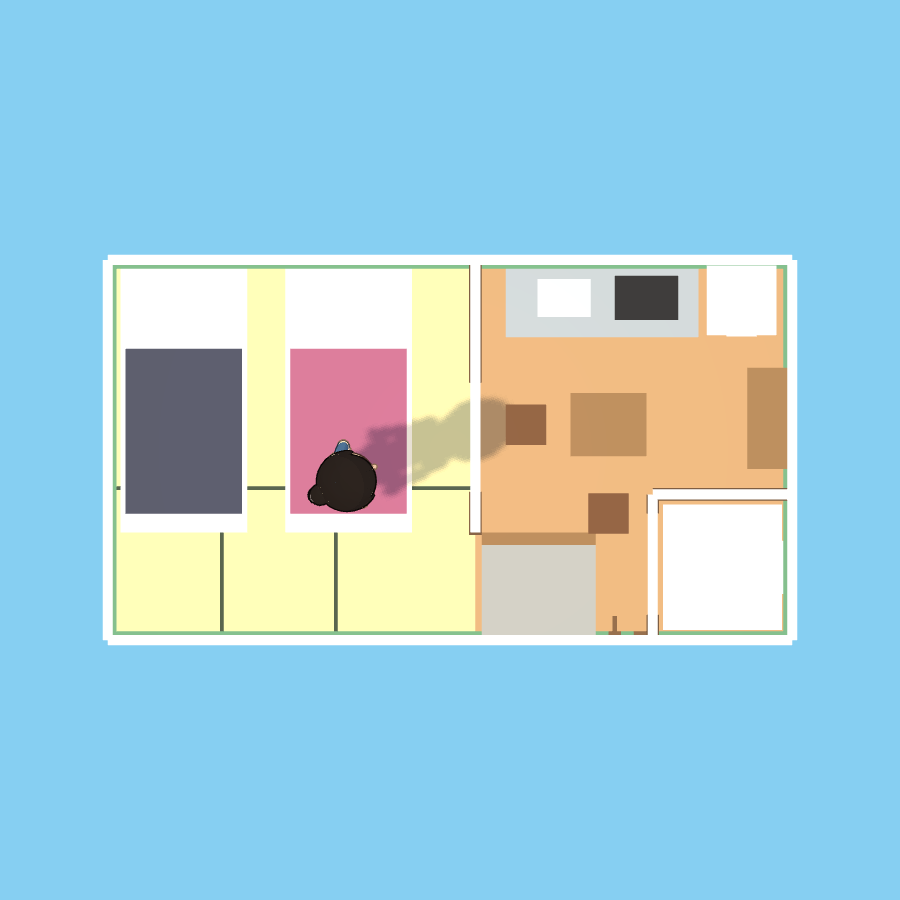
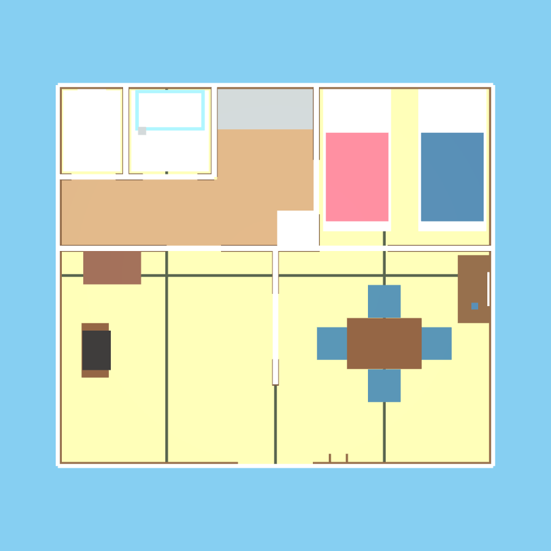
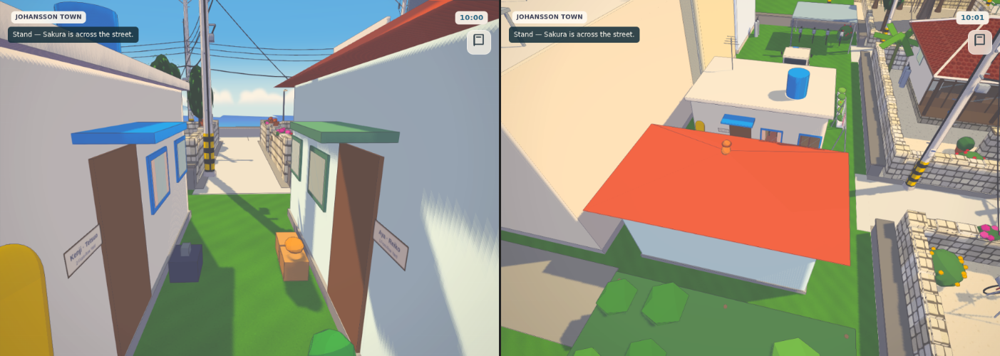
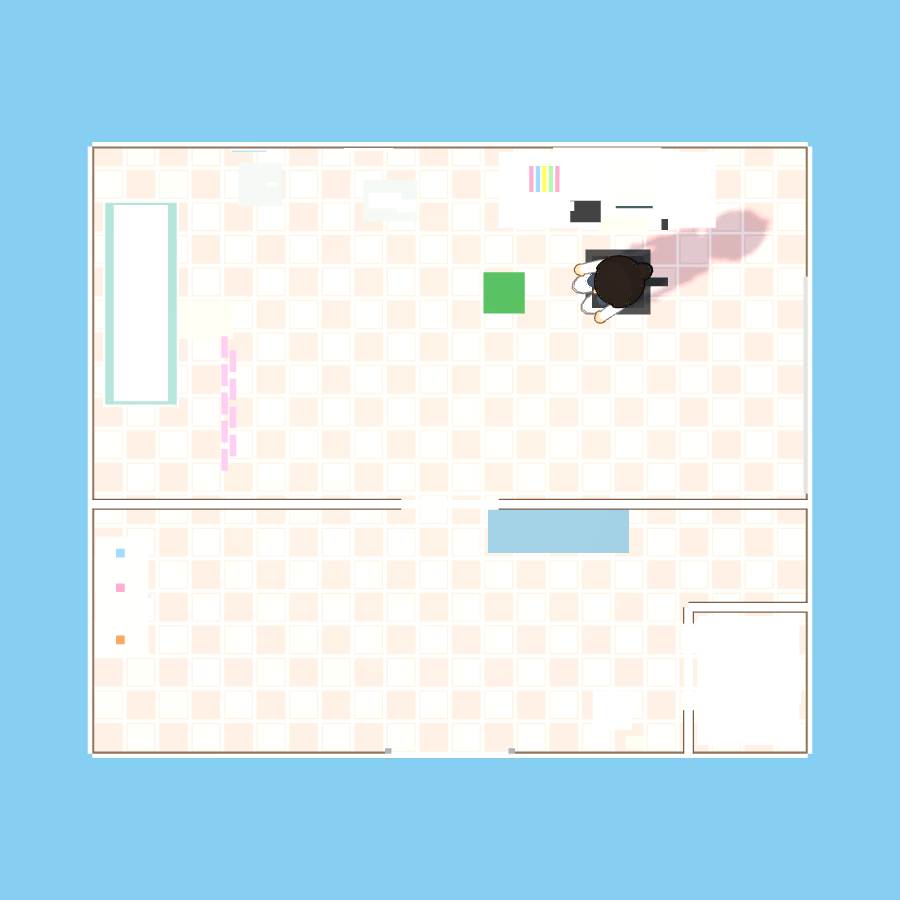
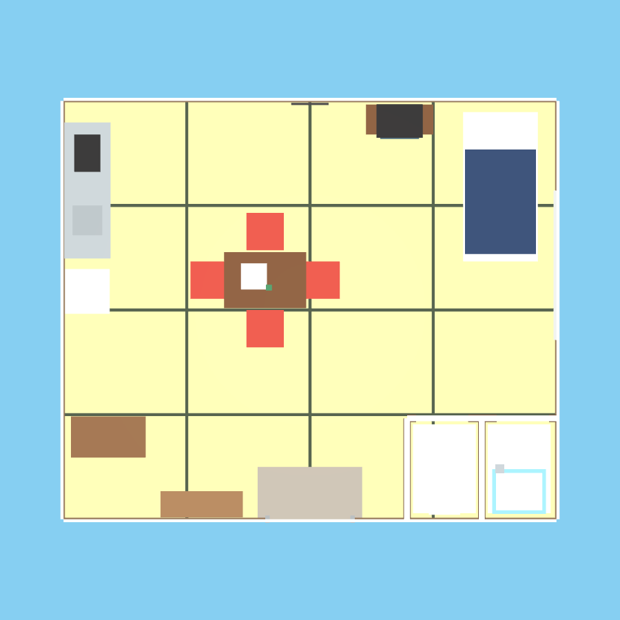

# Minato buildings: a floor-plan audit

**Written as:** a house architect (一級建築士) in Naha, 1986, asked by the town to survey every building you can walk into.
**Tool:** [Khaaka](https://github.com/BipulRaman/Khaaka) (MIT), a browser floor-plan editor from GitHub's `floorplan-editor` topic. Every plan in `docs/building-plans/` is a Khaaka file you can open and edit.
**Date of survey:** 3 October 2026 (in-game year 1997).

## Method

The plans were measured from the game itself.
- **Walls.** Each building was entered through the audit harness (`?audit`). Rays were cast along every 0.91 m grid line at 0.6, 1.2 and 1.95 m above the floor. A hit at full height is wall; a hit only lower down is furniture.
- **Extent.** The extent is the floor mesh under the player.
- **Grid.** The grid is the half-ken (半間, 0.91 m), the module every Okinawan carpenter used. One ken is 1.82 m, one tsubo 3.3 m², one jō (one tatami) 1.62 m².
- **Fittings.** Each plan was checked for what the building type needs. Homes need a kitchen, toilet, bath, butsudan or tōtōmē, bedding, an entrance and a tokonoma. Shops need a counter, toilet and storage; civic rooms need a counter and toilet.
- **Site plan.** The site plan holds the footprint of every building in town (50 of them).

## The site

`building-plans/town-site.khaaka.json`: all 50 buildings in plan, and the roads, on a 1-ken grid.

Footprints are sensible. Most houses are 5–7 m a side, 10–13 tsubo, which is a normal 1970s concrete house on a Kitahama plot. There is one note: **19 of the old-town houses share one 6.9 × 6.3 m footprint.** A real street has some variety, but a public-housing (県営住宅) row like this is true to life.

## Every building

`Rooms` counts connected spaces; doorways join rooms, so a house with sliding doors counts as one. `Off module` is how far the outer walls sit from the half-ken grid.

| Building | Size (m) | Tsubo | Jō | Ceiling (m) | Off module (m) | Rooms | Missing |
|---|---|---|---|---|---|---|---|
| Minato Clinic (*after*) | 6.6 × 5.6 | 11.2 | 22.8 | 2.85 | 0.23 | 2 | none |
| Community Kitchen (*after*) | 6.6 × 5.6 | 11.2 | 22.8 | 2.85 | 0.23 | 1 | none (hall WC here) |
| Minato Police Box (*after*) | 6.8 × 3.9 office + 6.8 × 2.3 room | 8 | 16.4 | — | 0.43 | 2 | none (WC behind the officer’s room) |
| Mayor’s Office | 6.6 × 5.6 | 11.2 | 22.8 | 2.85 | 0.23 | 1 | none (hall WC) |
| Johansson Harbour Office (*after*) | 6.74 × 6.74 | 13.7 | 28 | 2.9 | 0.37 | 1 | none |
| Umi-no-yu | 9.7 × 13.7 | 40 | 81 | 2.8 | — | 4 | toilet |
| Town Hall Classroom | 9 × 7.2 | 19.6 | 40 | 3 | 0.1 | 1 | counter, toilet |
| Kitahama family homes ×10 (*after*) | 6.4 × 5.6 | 10.8 | 22.1 | 2.7 | 0.14 | 1 | none (see below) |
| Mayor’s House (*after*) | 6.6 × 5.6 | 11.2 | 22.8 | 2.85 | 0.23 | 1 | butsudan, tokonoma (a single foreigner’s home) |
| Aya & Reiko’s home (*after*) | 5.4 × 3.0 | 4.9 | 10 | 2.5 | — | 1 | bath (they use Umi-no-yu) |
| Kenji & Tetsuo’s home (*after*) | 5.4 × 3.4 | 5.6 | 11.3 | 2.5 | — | 1 | bath (they use Umi-no-yu) |
| Thuan & Nao’s home (*after*) | 6.4 × 5.6 | 10.8 | 22.1 | 2.7 | 0.14 | 1 | none (red-tile, entered from the veranda) |
| Mrs Sato’s home | 5.98 × 5.96 | 10.8 | 22 | 2.8 | 0.41 | 1 | the same |
| Dock Electrical & Repair | 8.56 × 7.16 | 18.5 | 37.8 | 2.75 | 0.37 | 2 | counter, toilet, storage |
| Front-Row Books | 8.56 × 7.16 | 18.5 | 37.8 | 2.75 | 0.37 | 2 | toilet, storage |
| Minato Izakaya | 18.1 × 13 | 71.2 | 145.2 | 3.8 | 0.26 | 1 | counter, toilet |
| Sakura Shōten | 13.72 × 7.9 | 32.8 | 66.9 | 2.82 | 0.29 | 1 | none |
| Sato Ramen | 4.3 × 5.1 | 6.6 | 13.5 | 3.8 | — | 1 | toilet (shares the izakaya’s) |

A dash for the ceiling means the room has no ceiling mesh: you look up into the roof void.

## Findings

Severity:
- **A** means people could not live or work in it as built.
- **B** is inconsistent.
- **C** is a missing fitting.

| # | Sev | Building | Finding | Status |
|---|---|---|---|---|
| B1 | A | All 10 Kitahama family homes | **One bare 6.4 × 5.6 m box**: 22 jō with no partition, no toilet, no bath and no entrance step. Red-tile and concrete houses had the *same* inside. The house to let advertised “2DK, kitchen and bath”, but there were none. | **Fixed.** Two real plans; see below. |
| B2 | A | Thuan & Nao’s home | **The futon was laid outside the wall.** Their in-home routine was measured for another flat, so Thuan walked to a bed at x −4.15, outside the room. | **Fixed.** Every house now gives each resident their own bed, seat and hat peg (`homeLayouts`). |
| B3 | B | Onsen → every room | The onsen renamed the shared room group, so later rooms reported “Umi-no-yu interior”. | **Fixed.** The name is reset when a room is cleared. |
| B4 | A | Aya, Kenji, Thuan | Three households lived in one identical 7 × 6.8 m shell with no kitchen, toilet or bath. The yard houses were **4.2 m wide outside** and 7 m wide inside. | **Fixed.** The yard houses are 5.6 m wide, the most the yard takes beside the laundry. Inside each is a staff 1K drawn to its walls (see below). Thuan and Nao live in a red-tile Kitahama house like their neighbours’. |
| B5 | B | Clinic, community kitchen, mayor’s office, mayor’s house | Four different uses share one 6.6 × 5.6 m shell. A clinic needs a waiting room, a consulting room and a WC; a mayor’s house is a home. | **Partly fixed.** The clinic has a waiting room (bench, scales, dispensary cabinet) in front of the consulting room, and a patients’ WC with a sample hatch. The mayor’s house has its WC and a small tiled bath. See B10 for the shell itself. |
| B6 | B | Izakaya | The izakaya is a **13 × 13 m** hall (51 tsubo) with a 3.8 m ceiling. A 1980s Okinawan izakaya is 15–20 tsubo: a counter of 8 stools, a 6-jō zashiki and a kitchen behind a noren. Sato Ramen, measured at 18 × 13 m in the first pass, is really **4.3 × 5.1 m** (6.6 tsubo, right for a counter shop): the survey had read the izakaya model it shares. | **Open.** The izakaya is one model; shrinking it to about 9 × 6 m and adding a kitchen and WC means rebuilding it. |
| B7 | C | Every shop and civic building except Sakura | **No toilet.** The Building Standards Act asks for sanitary facilities in any building people work in all day. | **Mostly fixed.** WCs in the mayor’s house, the clinic, the kōban (behind Officer Mori’s room), the harbour office, both yard houses and Thuan and Nao’s house. The hall’s public WC is off the community kitchen and serves the mayor’s office and the classroom. Front-Row Books and the repair workshop are served by their staff houses in the yard behind. **Open:** the izakaya and Umi-no-yu. |
| B8 | C | Umi-no-yu | The first pass measured a 10 × 1.4 m strip. That was the survey: the bathhouse is **9.7 × 13.7 m**, with lobby, changing room, bath hall and rock bath. It has **no WC**. | **Open.** Put the WC off the changing room, in the west locker bay; the bath’s seat positions have to move with it. |
| B9 | B | Most buildings | Outer walls sit 0.1–0.43 m off the half-ken grid. A carpenter would build to the grid; it also keeps tatami whole. | **Open.** Snap interiors to 0.91 m when they are rebuilt. |
| B10 | B | Town hall rooms | The four rooms along the field face are **6.6 m wide inside, but their doors are 3.6 m apart** on the building. Each room is nearly twice as wide as its bay. | **Open.** Rebuild them to a 2-ken (3.64 m) bay, about 3.5 × 5.6 m each: still 12 jō, enough for an office, a kitchen or a clinic. |

## The family homes, redrawn

| Before: one box | After: red-tile house | After: concrete 2DK |
|---|---|---|
|  |  |  |

**Red-tile house (赤瓦の家).** It follows the old Okinawan plan, which faces south with no genkan; you step up from the veranda (雨端, amahaji).
- **Front rooms.** Ichibanza (一番座), the guest room, has its tokonoma on the east wall. Nibanza (二番座), the family room, holds the butsudan and tōtōmē. Fusuma divide the two.
- **Back rooms.** Uraza (裏座) are the back rooms for sleeping, with futons and a futon chest.
- **Service rooms.** The kitchen, bath and toilet sit at the back on the west side, as they did once the old outside toilet came indoors.

**Concrete house (1970s 2DK).** It is the plan the prefectural housing corporation used.
- **Entrance.** A genkan with tiles, the step (上がり框) and a getabako.
- **Wet rooms.** WC and bath next to the genkan.
- **Living.** A dining kitchen (DK) and two tatami rooms behind fusuma.

`tests/family-home-plan.test.mjs` checks that every room and fitting can be reached on foot, in both kinds.

## The shared houses, redrawn

| Yard staff house (Aya & Reiko) | Thuan & Nao (red-tile) |
|---|---|
|  |  |

**Yard staff house (1K).** It is drawn for a door on the east of the front wall, and mirrored for Kenji and Tetsuo’s, whose door is on the west.
- **Entrance:** a genkan with its step, and the WC off it.
- **Kitchen:** sink and two gas rings on the back wall, the fridge, a table for two and a shelf (books for Aya and Reiko, a radio bench for Kenji).
- **Tatami room:** behind fusuma, where the two futons are laid out at night.
- **No bath:** like half the town, they go to Umi-no-yu, and the note on the fridge says so.

The houses outside were widened from 4.2 to 5.6 m to hold it.

**Thuan & Nao.** Their house is the red-tile plan, lived in by two working people. There is no altar. Their futons are laid out in the uraza, they eat at the low table in the ichibanza, and Thuan’s wardrobe stands against the nibanza wall. A laid futon is walked onto, so it has no collider.

## Town hall rooms

| Clinic | Mayor’s house |
|---|---|
|  |  |

`tests/resident-home-plan.test.mjs` walks every resident from the door to the table, to bed, and back. It covers the yard houses, Thuan and Nao (both house kinds), Officer Mori and the harbour master. `tests/town-hall-plan.test.mjs` checks that every room in the mayor’s house, the clinic and the hall WC can be reached.

## Opening the plans in Khaaka

1. Clone `https://github.com/BipulRaman/Khaaka` and open `index.html` (or serve the folder).
2. **File → Open** and choose any `docs/building-plans/*.khaaka.json`.
3. Units are metres, and the grid is the half-ken (0.91 m). Walls are wall objects; furniture is in polygons.

`analysis.json` holds the numbers in the table above.
