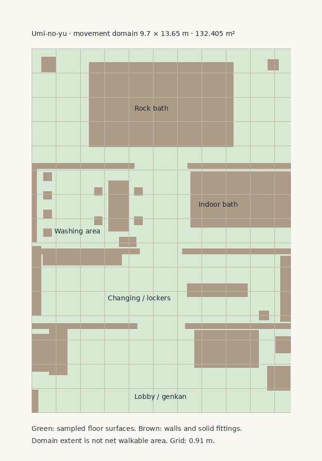

# Minato buildings: a floor-plan audit

**Written as:** a house architect (一級建築士) in Naha, 1986, asked by the town to survey every building you can walk into.
**Tool:** [Khaaka](https://github.com/BipulRaman/Khaaka) (MIT), a browser floor-plan editor from GitHub's `floorplan-editor` topic. Every plan in `docs/building-plans/` is a Khaaka file you can open and edit.
**Date of survey:** 3 October 2026 (in-game year 1997).

## Method

The original one-off browser survey was not retained as a generator. Its documented extent rule, “the floor mesh under the player”, explains the onsen's exact 10 × 1.4 m result: that is the first underlying genkan slab (`floorRect(-5,5,3.6,5)`), not the compound interior. The prose was subsequently corrected, but its JSON analysis and plan remained stale.

The repeatable correction uses `scripts/building-survey.mjs` and `scripts/build-building-audit.mjs`:
- **Extent:** the current runtime layout's movement bounds and, where defined, its floor polygon. Never one floor hit, nor a whole-scene box that includes the sea backdrop or a neighbouring venue.
- **Geometry:** execute the same interior builders with a headless canvas stub for signage. Sample all named floor surfaces at the movement datum on a 0.2 m grid, including nested transforms. Pool holes and lowered bath floors remain excluded. This is supporting floor coverage, **not net walkable area**: fittings and player clearance require navigation checks.
- **Plans:** green polygons show sampled floor support; brown polygons show full-height walls and collision fittings. Layout-only plans show the movement polygon and available authored colliders, not a verified geometry survey. No room count or door count is inferred from coarse ray hits.
- **Grid:** the drawing grid remains 0.91 m. Movement clearance bounds are not wall centre lines, so they cannot verify the former “off module” finding.
- **Fittings:** positive named geometry is recorded. Legacy missing-fitting lists are not an automatic proof of absence, particularly for shared facilities or layout-only evidence.
- **Scope:** eleven interiors cover the remaining open findings and the compound kōban. Other analysis rows and the town site plan remain historical; they were not re-surveyed by this correction. The generated rows carry the exact source revision and method.

<!-- full-domain-survey:start -->
Survey source: `80dc175fb588a91381a5e44fd479f464f23cc23a`. Regenerate with `node scripts/build-building-audit.mjs`, then `python3 scripts/render-building-plans.py onsen koban clinic community-kitchen mayor-office mayor-home frontrow form3d ramen izakaya school` from `johansson-town/`.

| Interior | Movement extent (m) | Domain (m²) | Sampled floor (m²) | Evidence |
|---|---|---|---|---|
| Umi-no-yu | 9.7 × 13.65 | 132.405 | 112.589 | Current builder geometry |
| Minato Police Box | 6.6 × 6 | 39.6 | 39.6 | Current builder geometry |
| Minato Clinic | 6.5 × 5.5 | 35.75 | 35.75 | Current builder geometry |
| Community Kitchen | 6.5 × 5.5 | 35.75 | 35.75 | Current builder geometry |
| Mayor’s Office | 6.5 × 5.5 | 35.75 | 35.75 | Current builder geometry |
| Mayor’s House | 6.5 × 5.5 | 35.75 | 35.75 | Current builder geometry |
| Front-Row Books | 8.4 × 7 | 58.8 | 58.8 | Current builder geometry |
| Dock Electrical & Repair Workshop | 8.4 × 7 | 58.8 | 58.8 | Current builder geometry |
| Sato Ramen | 17.4 × 12.4 | 202.26 | not sampled | Current layout only |
| Minato Izakaya | 17.4 × 12.4 | 202.26 | not sampled | Current layout only |
| Town Hall Classroom | 8.58 × 6.84 | 58.687 | not sampled | Current layout only |
<!-- full-domain-survey:end -->

**Open-finding re-check:** B5/B10 capture the full civic shells, so their architectural questions are not caused by a partial-floor selection. B6 needs revised shared-venue interpretation. B7/B8 fitting provision cannot be inferred from extent; the onsen builder supplies lockers, washing and baths, but no WC. B9 requires structural wall-centre measurements rather than clearance bounds. The kōban also had a partial survey: its office slab omitted the tatami room and WC. Its regenerated evidence now includes both main floor surfaces and the WC floor.

## The site

`building-plans/town-site.khaaka.json`: all 50 buildings in plan, and the roads, on a 1-ken grid.

Footprints are sensible. Most houses are 5–7 m a side, 10–13 tsubo, which is a normal 1970s concrete house on a Kitahama plot. There is one note: **19 of the old-town houses share one 6.9 × 6.3 m footprint.** A real street has some variety, but a public-housing (県営住宅) row like this is true to life.

## Original architectural inventory (historical measurements)

The table below records the earlier architectural inventory. Use the generated current measurement table above for extents; do not interpret these historical room counts, module offsets or missing lists as new measurement results.

| Building | Size (m) | Tsubo | Jō | Ceiling (m) | Off module (m) | Rooms | Missing |
|---|---|---|---|---|---|---|---|
| Minato Clinic (*after*) | 6.6 × 5.6 | 11.2 | 22.8 | 2.85 | 0.23 | 2 | none |
| Community Kitchen (*after*) | 6.6 × 5.6 | 11.2 | 22.8 | 2.85 | 0.23 | 1 | none (hall WC here) |
| Minato Police Box (*after*) | 6.8 × 3.9 office + 6.8 × 2.3 room | 8 | 16.4 | — | 0.43 | 2 | none (WC behind the officer’s room) |
| Mayor’s Office | 6.6 × 5.6 | 11.2 | 22.8 | 2.85 | 0.23 | 1 | none (hall WC) |
| Johansson Harbour Office (*after*) | 6.74 × 6.74 | 13.7 | 28 | 2.9 | 0.37 | 1 | none |
| Umi-no-yu | 9.7 × 13.7 | 40 | 81 | 2.8 | — | 4 | toilet |
| Town Hall Classroom | 9 × 7.2 | 19.6 | 40 | 3 | 0.1 | 1 | counter, toilet |
| Kitahama family homes ×10 (*after*) | 6.4 × 5.6 | 10.8 | 22.1 | 2.7 | 0.14 | 1 | none (see below) |
| Mayor’s House (*after*) | 6.6 × 5.6 | 11.2 | 22.8 | 2.85 | 0.23 | 1 | butsudan, tokonoma (a single foreigner’s home) |
| Aya & Reiko’s home (*after*) | 5.4 × 3.0 | 4.9 | 10 | 2.5 | — | 1 | bath (they use Umi-no-yu) |
| Kenji & Tetsuo’s home (*after*) | 5.4 × 3.4 | 5.6 | 11.3 | 2.5 | — | 1 | bath (they use Umi-no-yu) |
| Thuan & Nao’s home (*after*) | 6.4 × 5.6 | 10.8 | 22.1 | 2.7 | 0.14 | 1 | none (red-tile, entered from the veranda) |
| Mrs Sato’s home | 5.98 × 5.96 | 10.8 | 22 | 2.8 | 0.41 | 1 | the same |
| Dock Electrical & Repair | 8.56 × 7.16 | 18.5 | 37.8 | 2.75 | 0.37 | 2 | counter, toilet, storage |
| Front-Row Books | 8.56 × 7.16 | 18.5 | 37.8 | 2.75 | 0.37 | 2 | toilet, storage |
| Minato Izakaya | 18.1 × 13 | 71.2 | 145.2 | 3.8 | 0.26 | 1 | counter, toilet |
| Sakura Shōten | 13.72 × 7.9 | 32.8 | 66.9 | 2.82 | 0.29 | 1 | none |
| Sato Ramen | 4.3 × 5.1 | 6.6 | 13.5 | 3.8 | — | 1 | toilet (shares the izakaya’s) |

A dash for the ceiling means the room has no ceiling mesh: you look up into the roof void.

## Findings

Severity:
- **A** means people could not live or work in it as built.
- **B** is inconsistent.
- **C** is a missing fitting.

| # | Sev | Building | Finding | Status |
|---|---|---|---|---|
| B1 | A | All 10 Kitahama family homes | **One bare 6.4 × 5.6 m box**: 22 jō with no partition, no toilet, no bath and no entrance step. Red-tile and concrete houses had the *same* inside. The house to let advertised “2DK, kitchen and bath”, but there were none. | **Fixed.** Two real plans; see below. |
| B2 | A | Thuan & Nao’s home | **The futon was laid outside the wall.** Their in-home routine was measured for another flat, so Thuan walked to a bed at x −4.15, outside the room. | **Fixed.** Every house now gives each resident their own bed, seat and hat peg (`homeLayouts`). |
| B3 | B | Onsen → every room | The onsen renamed the shared room group, so later rooms reported “Umi-no-yu interior”. | **Fixed.** The name is reset when a room is cleared. |
| B4 | A | Aya, Kenji, Thuan | Three households lived in one identical 7 × 6.8 m shell with no kitchen, toilet or bath. The yard houses were **4.2 m wide outside** and 7 m wide inside. | **Fixed.** The yard houses are 5.6 m wide, the most the yard takes beside the laundry. Inside each is a staff 1K drawn to its walls (see below). Thuan and Nao live in a red-tile Kitahama house like their neighbours’. |
| B5 | B | Clinic, community kitchen, mayor’s office, mayor’s house | Four different uses share one 6.6 × 5.6 m shell. A clinic needs a waiting room, a consulting room and a WC; a mayor’s house is a home. | **Partly fixed.** The clinic has a waiting room (bench, scales, dispensary cabinet) in front of the consulting room, and a patients’ WC with a sample hatch. The mayor’s house has its WC and a small tiled bath. See B10 for the shell itself. |
| B6 | B | Izakaya | The original survey conflated model extent, venue size and movement extent. Current Minato and Sato entrances both use the same **17.4 × 12.4 m** movement envelope and **202.26 m²** L-shaped domain. The former 4.3 × 5.1 m isolated ramen layout is not the current default path. This shared domain must not be counted twice as two independent rooms. | **Needs a separate venue-area review.** Do not justify resizing the working shared interior using the former single-floor/model measurement. Kitchen counters exist in the current shared collision layout; WC absence was not established by this layout-only check. |
| B7 | C | Every shop and civic building except Sakura | **No toilet.** The Building Standards Act asks for sanitary facilities in any building people work in all day. | **Mostly fixed.** WCs in the mayor’s house, the clinic, the kōban (behind Officer Mori’s room), the harbour office, both yard houses and Thuan and Nao’s house. The hall’s public WC is off the community kitchen and serves the mayor’s office and the classroom. Front-Row Books and the repair workshop are served by their staff houses in the yard behind. **Remaining:** no WC geometry in the current onsen builder; izakaya WC provision needs a separate geometry/shared-facility check. Extent alone cannot establish missing fittings. |
| B8 | C | Umi-no-yu | The first survey selected only the entrance slab. Current runtime bounds are **9.7 × 13.65 m** (132.405 m² domain). All five indoor floor slabs plus rock-bath paving are included. Lockers, washing stations and both baths are retained and recorded. No WC is built by this builder. | **Measurement error corrected.** The separate WC provision finding remains open; this audit correction makes no gameplay or layout changes. |
| B9 | B | Most buildings | Outer walls sit 0.1–0.43 m off the half-ken grid. A carpenter would build to the grid; it also keeps tatami whole. | **Unverified by this correction.** Movement bounds include clearance and cannot establish wall-centre module offsets. Survey wall centres separately before recommending changes. |
| B10 | B | Town hall rooms | The four rooms along the field face are **6.6 m wide inside, but their doors are 3.6 m apart** on the building. Current builders give all four rooms a 6.5 × 5.5 m movement domain within their 6.6 × 5.6 m shells. The full floor was captured; this is not an entrance-only measurement. The exterior bay comparison remains a separate source finding. | **Open.** Rebuild them to a 2-ken (3.64 m) bay, about 3.5 × 5.6 m each: still 12 jō, enough for an office, a kitchen or a clinic. |

## The family homes, redrawn

| Before: one box | After: red-tile house | After: concrete 2DK |
|---|---|---|
|  |  |  |

**Red-tile house (赤瓦の家).** It follows the old Okinawan plan, which faces south with no genkan; you step up from the veranda (雨端, amahaji).
- **Front rooms.** Ichibanza (一番座), the guest room, has its tokonoma on the east wall. Nibanza (二番座), the family room, holds the butsudan and tōtōmē. Fusuma divide the two.
- **Back rooms.** Uraza (裏座) are the back rooms for sleeping, with futons and a futon chest.
- **Service rooms.** The kitchen, bath and toilet sit at the back on the west side, as they did once the old outside toilet came indoors.

**Concrete house (1970s 2DK).** It is the plan the prefectural housing corporation used.
- **Entrance.** A genkan with tiles, the step (上がり框) and a getabako.
- **Wet rooms.** WC and bath next to the genkan.
- **Living.** A dining kitchen (DK) and two tatami rooms behind fusuma.

`tests/family-home-plan.test.mjs` checks that every room and fitting can be reached on foot, in both kinds.

## The shared houses, redrawn

| Yard staff house (Aya & Reiko) | Thuan & Nao (red-tile) |
|---|---|
|  |  |

**Yard staff house (1K).** It is drawn for a door on the east of the front wall, and mirrored for Kenji and Tetsuo’s, whose door is on the west.
- **Entrance:** a genkan with its step, and the WC off it.
- **Kitchen:** sink and two gas rings on the back wall, the fridge, a table for two and a shelf (books for Aya and Reiko, a radio bench for Kenji).
- **Tatami room:** behind fusuma, where the two futons are laid out at night.
- **No bath:** like half the town, they go to Umi-no-yu, and the note on the fridge says so.

The houses outside were widened from 4.2 to 5.6 m to hold it.

**Thuan & Nao.** Their house is the red-tile plan, lived in by two working people. There is no altar. Their futons are laid out in the uraza, they eat at the low table in the ichibanza, and Thuan’s wardrobe stands against the nibanza wall. A laid futon is walked onto, so it has no collider.

## Town hall rooms

| Clinic | Mayor’s house |
|---|---|
|  |  |

`tests/resident-home-plan.test.mjs` walks every resident from the door to the table, to bed, and back. It covers the yard houses, Thuan and Nao (both house kinds), Officer Mori and the harbour master. `tests/town-hall-plan.test.mjs` checks that every room in the mayor’s house, the clinic and the hall WC can be reached.

## Opening the plans in Khaaka

1. Clone `https://github.com/BipulRaman/Khaaka` and open `index.html` (or serve the folder).
2. **File → Open** and choose any `docs/building-plans/*.khaaka.json`.
3. Units are metres, and the grid is the half-ken (0.91 m). Walls are wall objects; furniture is in polygons.

`analysis.json` contains the current generated measurement rows and historical rows outside this pass. `measurement-review.json` records scope, source and positive geometry evidence. Room counts, ceiling heights and missing-fitting lists outside the measured scope remain historical.
