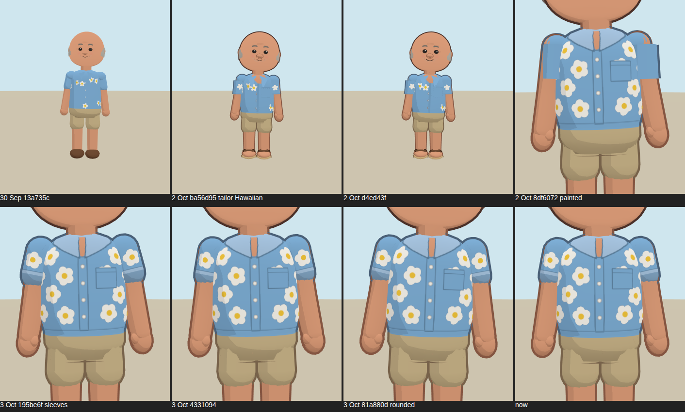
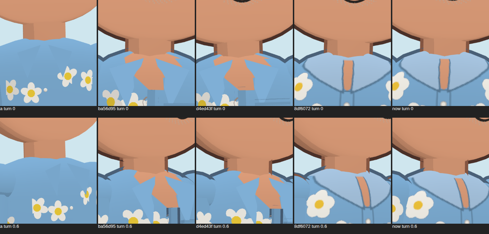
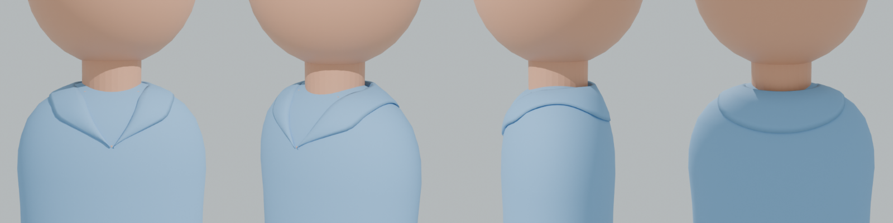
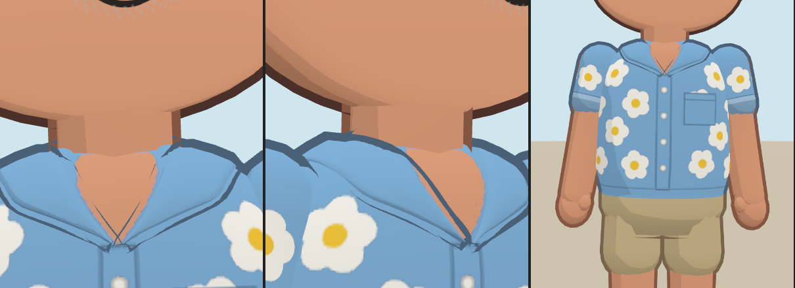
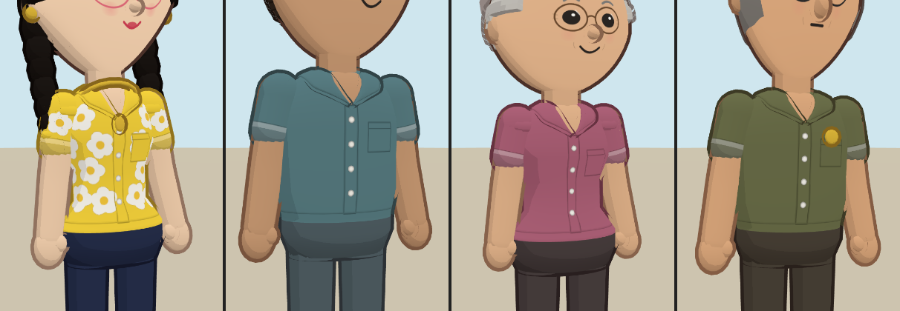

# Johansson's collar: an art-direction review

**Written as:** a character art director (Nintendo or Disney style) reviewing one costume detail on a lead character.
**Question asked:** did the collar regress, and what is wrong with it?

## The verdict

Yes, it regressed. On **2 October (`8df6072`, "paint shirt details on one smooth garment")** every collar was moved from geometry into the shirt texture. That rule was right for buttons, pockets and prints. It was wrong for Johansson's collar.

| Version | What the collar was | Read at game distance |
|---|---|---|
| 30 Sep `13a735c` | Faint creases in the cloth | No collar at all |
| 2 Oct `ba56d95` / `d4ed43f` | **Modelled lapels and an open V** | Reads as a camp collar. The V was a bow-tie shape and the lapels were flat cards, but it had a silhouette. This is the version that "was pretty good". |
| 2 Oct `8df6072` → 3 Oct | A **painted** band, lighter blue, round the neck | Reads as a **bib or a cape**, not a collar |

## What is wrong with the painted collar

These are the notes I would give the team. The worst problem is first.

1. **There is no silhouette.**
   - A collar is a form, not a colour. In Mii and Disney toon work, the costume's big shapes are held by the outline and by the shadow under each edge.
   - A painted collar has neither, so on a phone at third-person distance it vanishes into the shirt.
2. **The value is wrong.**
   - The painted collar was **lighter** than the shirt (shirt colour lightened 22%), with a band all the way round.
   - A lighter band round the neck and over the shoulders is how you draw a bib, a cape or a sailor collar, not a kariyushi.
   - A real collar is the *same* cloth; it separates by form and shadow, not by a different tint.
3. **The V collapsed into a stripe.**
   - The skin V was painted in texture space. Near the top of the torso the lathe narrows, so the texture stretches sideways and the V's tip compresses.
   - On screen it became a thin skin-coloured strip down the chest, which read like a tie or a tear.
4. **There is no stand behind the neck.**
   - A camp collar rises behind the neck and rolls over; that roll is what makes a shirt look worn rather than printed.
   - From the side and back, the painted collar was invisible.
5. **The proportions were wrong.**
   - The band stretched across the shoulder caps, which widened the shoulders and shortened the neck.
   - On an older man with a big head that reads as hunched.

What the 2 October modelled version got right: a real edge, an open V, and the same cloth. What it got wrong: flat card lapels, a bow-tie V, and no roll behind the neck.

## The fix: modelled in Blender

`tools/blender/kariyushi_collar.py` builds the collar in Blender (run it with the `bpy` module or Blender 4.2+).
- **Drape.** It is draped on the avatar's *own* torso: the same lathe profile and measurements as `build.js`. The fall is laid by walking down the body surface, so it sits on the shoulders and the back instead of cutting into them.
- **Pattern.** It is cut like a real open camp collar:
  - a **stand** that rises behind the neck,
  - a **roll line** where it folds over,
  - a **fall** lying on the shoulders,
  - **reverses** that fold back down the front to a **V that closes on the first button**.
- **Finish.** Solidify gives it cloth thickness (11 mm at Johansson's scale) and Subdivision Surface rounds the roll, so the fold catches light as a soft edge, not a blade.
- **Export.** It is exported to `src/avatars/collar-mesh.js` (930 vertices) in body-relative units. `build.js` scales it to each body, so it fits everyone who wears a kariyushi.

In the game:
- The collar is **the shirt's own colour**, carries the ink outline, and is bound to the chest bone.
- The torso paints only the small V of skin under it, matched to the reverses' fold.
- The painted lapels and band are gone.

## Guard rails

`tests/avatar-polish.test.mjs` now checks three things:
- The kariyushi's collar **rises behind the neck, clear of it**, on Johansson and on Thuan.
- The open V is painted.
- There are **no painted lapels** as well.

The other shirts (polo, blouse, jacket, smock) keep painted collars; their collars are small and flat in life.

## Next notes (not done)

- **Polo and police shirt.** These would benefit from the same treatment: a small modelled collar with points.
- **Print.** Real kariyushi carry the print onto the collar. A Mii keeps the collar plain; that choice is deliberate.

## Update, 3 October: the collar from the owner's reference

The owner's reference picture shows a notched camp collar, drawn flat with ink edges: a pointed leaf on each side
reaching toward the shoulder, a lapel below it with a notch between, an open V down to a wooden first button, and
plain cloth with no print on the collar.

The Blender collar lay mostly on the top of the shoulders, so from the front it read too small against the neck.
Its front reverses also crossed at the first button and drew a dark X in the outline. Now:
- **Leaves and lapels are drawn** on the chest (garment.js) at fractions of the cloth's width at each height, so the
  narrow neck end doesn't stretch them. They are the shirt colour with a heavier ink edge, and the print stops under them.
- **The stand is modelled** (build.js): a band of shirt round the back and sides of the neck that rolls a little
  outward. It tapers to nothing at the front, where it turns into the drawn leaves. It is what gives the collar its
  silhouette from the side and back.
- **The neck is slimmer** (radius 1.08 × arm instead of 1.2), so the collar wraps it.
- `collar-mesh.js` and its Blender script are gone: nothing used them any more.
