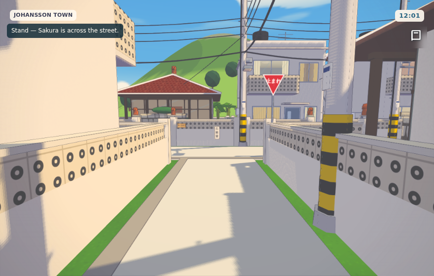
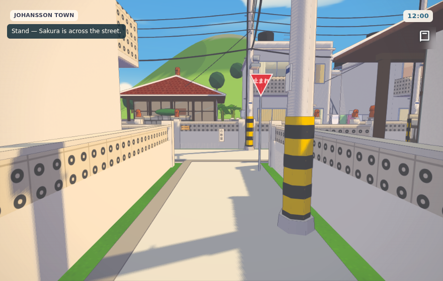
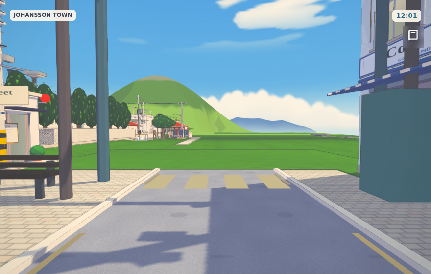
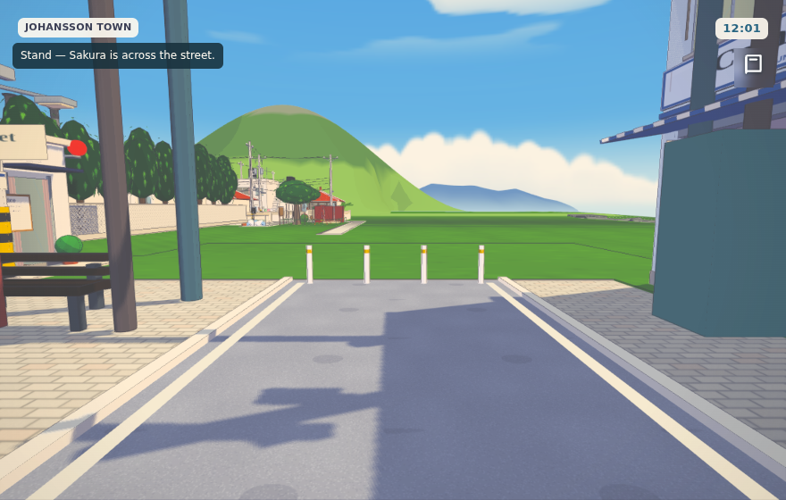
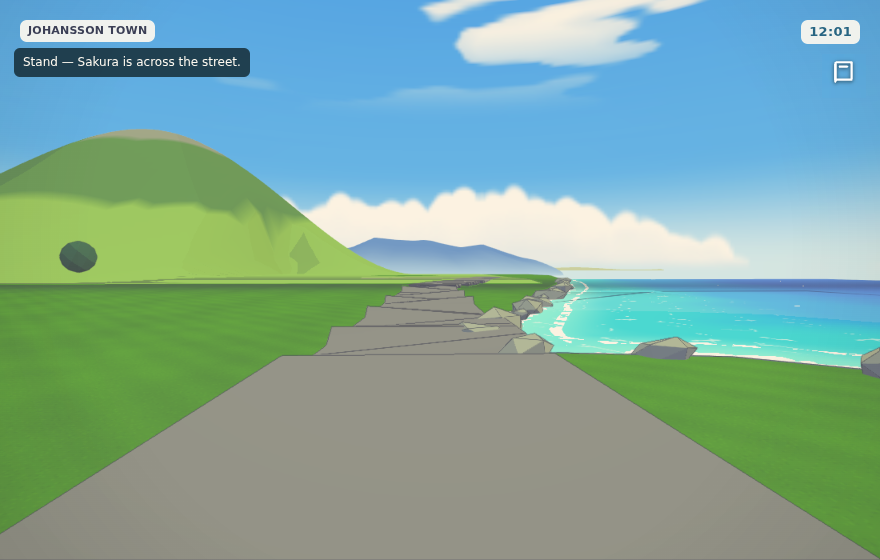
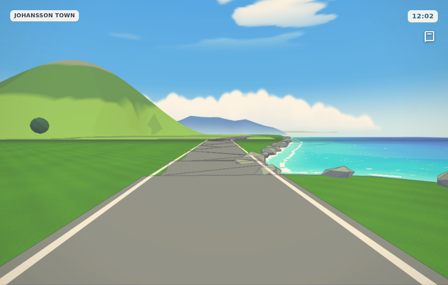
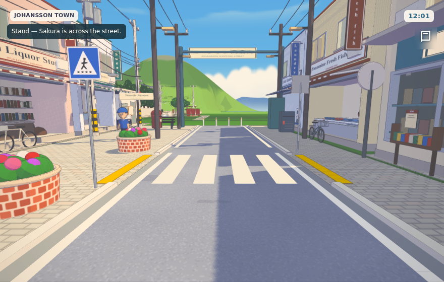
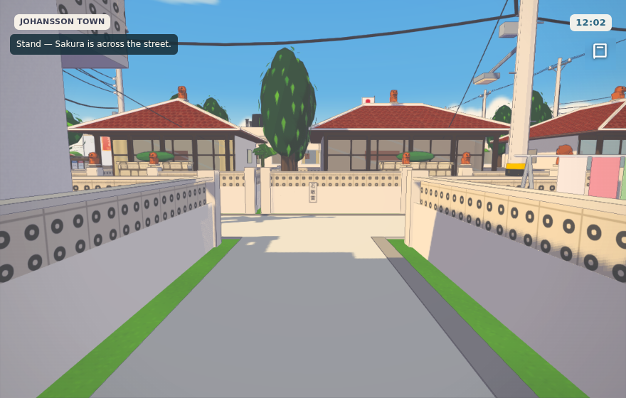

# Minato public realm: a standardisation audit

**Written as:** a city architect in an Okinawan municipal public-works office, 1997.
**Scope:** public roads, footways, crossings, road furniture and public open space in Minato, Kitahama and the island coastal road. Private buildings are out of scope.
**Date of survey:** 3 October 2026 (in-game year 1997).

## Method

The survey was measured, not sketched:
- A top-down orthographic plan of the whole town.
- A scan of all 6,235 meshes and 631 colliders against the town's own ground and route map.
- The route network read out with each route's width and surface.
- Eye-level photographs at Main Street, both crossings, the north road end, the quay, Kitahama's lanes and junctions, and both arms of the coastal road.

## Standards applied (as in force in 1997)

| Instrument | What it governs here |
|---|---|
| 道路構造令 (Road Structure Ordinance) | Lane widths. Roads narrower than 5.5 m are single carriageways **without a centre line**. Raised kerb between footway and road; footway at least 2 m where there are shops. |
| 道路標識、区画線及び道路標示に関する命令 (signs and markings order) | All road paint is **white**: solid 15 cm edge lines (外側線); zebra crossings of 45 cm bars with 45 cm gaps and, since 1992, **no side lines**; a stop line with 止まれ painted before it. Sign 330 (red inverted triangle, 一時停止) where a minor road joins. Sign 407-A (blue square, crossing) at each end of a crossing. |
| 点字ブロック practice (national guidance, JIS to follow in 2001) | Yellow warning blocks at the head of every crossing and at terminal edges. |
| 都市公園法 (Urban Parks Act) | A neighbourhood park carries a name board, lighting, benches, a drinking fountain, a toilet within reach, and play equipment. |
| Okinawan practice | Traffic keeps left (since 730, 1978). An ishiganto (石敢當) in the wall where a road runs straight into a house. Typhoon-proof concrete, flower-block walls (花ブロック), fukugi windbreaks, coral-stone walls. Poles banded yellow and black at the foot. |

## Findings

Severity:
- **A** contravenes the standard, or is unsafe as built.
- **B** is inconsistent between places.
- **C** is missing equipment.

### Roads and paint

| # | Sev | Where | Finding | Status |
|---|---|---|---|---|
| R1 | A | Main Street | Crossing paint was **beige**, not white. The two crossings on the old deck section were not painted at all, so they were invisible to drivers. | **Fixed.** Standard white zebras (45/45 cm, no side lines) at both crossings. |
| R2 | A | Main Street | Edge lines were **dashed** and, on the north section, **ochre**. An edge line is solid white. | **Fixed.** Solid white 15 cm lines the full length. |
| R3 | A | Main Street, north end | The carriageway ran **straight into a lawn**, with a crossing painted across the last 2 m that led nowhere. | **Fixed.** The false crossing is removed. 車止め posts (white, yellow band) close the road end, just beyond the carriageway. |
| R4 | B | Bus approach | The bus approach, which continues Main Street, was still **6 m** wide while the street had been narrowed to 4.5 m, giving a step in the road edge. | **Fixed.** It takes the street's width. |
| R5 | A | Coastal road | 640 m of **unmarked** grey ribbon: no edge lines, no shoulder. | **Fixed.** Solid white edge lines both sides, following the ground. |
| R6 | A | Coastal road, east and west shore | **Revetment rocks lie on the carriageway** at the bends by the sea. There is no guardrail where the road runs at the water's edge. | **Open.** Realign the road 1.5 m inland, or move the revetment seaward. Then add a white steel guardrail (Gr-C type) on the sea side. |
| R7 | B | Network | No common cross-section. Main Street is 4.5 m, the coastal road 5 m, the shopping lane 6 m, and lanes 2.5–3.6 m. Each is drawn by its own code. | **Partly fixed.** `road-standards.js` now holds the marking and furniture standards. Widths still need classes: *town street 4.5 m*, *island road 5.5 m* (centre line allowed), *lane 3 m*, *footpath 2 m*. |
| R8 | A | Coastal road | The ribbon shows **faceted kinks** where its straight segments meet. | **Open.** Build it as a smoothed curve, not as a chain of rectangles. |

### Junctions and signs

| # | Sev | Where | Finding | Status |
|---|---|---|---|---|
| J1 | C | Whole town | **No regulatory signs at all.** No 止まれ, no crossing sign, no speed limit, no school-zone signs. | **Started.** Blue 407-A signs at both Main Street crossings, and the 330 stop sign with stop line and 止まれ at the Kitahama approach. |
| J2 | C | Kitahama T-junctions | Three lanes run straight into house walls (approach/cross lane, Fukugi Lane/spine, Well Lane/spine), each **without an ishiganto**. | **Fixed.** 石敢當 tablets set in the facing walls. |
| J3 | C | School | No **スクールゾーン** paint, no 通学路 signs, no guard pipes at the school gate. | **Open.** |
| J4 | C | Main Street | No street-name or address plates (町名表示板, blue enamel, on the poles). | **Open.** |

### Footways and accessibility

| # | Sev | Where | Finding | Status |
|---|---|---|---|---|
| F1 | A | Main Street west | (From the previous pass.) The west side had **no footway**; the shops stood on the asphalt. | Fixed: 2.5 m footway and kerbs. |
| F2 | C | Crossings, quay | **No tactile paving.** | **Fixed at both crossings:** yellow warning blocks each side. **Open** at the ferry terminal edge. |
| F3 | B | Kitahama lanes | Pale concrete with grass verges, but **no side drainage**. Every Okinawan lane has a U-section gutter (U字溝) with concrete lids, because the rain here is tropical. | **Open.** |
| F4 | B | Kitahama | Painted markings on pale concrete are low in contrast. | Accepted as true to life. |

### Utilities

| # | Sev | Where | Finding | Status |
|---|---|---|---|---|
| U1 | A | Kitahama | **13 utility poles stood inside garden walls**: the whole pole line along the cross lane, the spine, Fukugi Lane, Well Lane and the approach. They were set 0.35 m *outside* the lane edge, which is exactly where the walls are. | **Fixed.** Every pole stands on its lane's verge, 0.25 m in from the edge, clear of the wall. |
| U2 | A | Shopping lane | Two poles stood **inside the kerbstones**. | **Fixed.** Moved clear. |
| U3 | B | Shopping lane | These poles are plain grey boxes, not the town's standard pole (banding, crossarm, transformer). | **Open.** Use `utilityPole()` from the Okinawan kit. |
| U4 | C | Whole town | No fire hydrants (消火栓 with the red sign) and no 防災行政無線 loudspeaker pole, which every Okinawan town of the period had. | **Open.** |

### Street furniture

| # | Sev | Where | Finding | Status |
|---|---|---|---|---|
| S1 | B | Whole town | **At least five bench designs on public ground** (the quay block bench, the street bench prop, the gate waiting bench, the garden bench and the park kit bench) and **five lamp-post designs** (west street lamp, quarter lamp, park lamp, cargo-yard lamp, harbour lantern). A public-works office specifies one bench and one lamp for streets, and one each for parks. | **Open.** Recommended catalogue below. |
| S2 | C | Sea wall | **Done in the previous pass:** chain bollards and brick planters as the standard set. | Done. |

### Public open space

| # | Sev | Where | Finding | Status |
|---|---|---|---|---|
| P1 | C | Minato Park | Under the Urban Parks Act a park of this size needs a **public toilet**, a **drinking fountain** and a **park clock pole**. It has none. The slide was removed on main, so there is **no play equipment** either. | **Open.** Add a toilet block in the park's own kit, a drinking fountain, a clock pole, and swings or a sandpit. |

## Recommended standard catalogue

| Item | Specification |
|---|---|
| Street bench | One design: concrete legs, timber slats, 1.8 m. |
| Park bench | The Minato Park kit bench. |
| Street lamp | The west street lamp (bracket arm) on all footways. |
| Park lamp | The Minato Park post. |
| Lane lighting | Lamps on the utility poles only, as is usual in residential lanes. |
| Bollards | Chain bollards at the sea wall; 車止め at road ends. |
| Planters | The brick planter. |
| Signs | 407-A, 330 and the speed limit, all on galvanised 60 mm posts, plates at 2.45 m. |
| Paint | White only. Ochre and yellow appear nowhere on the road except where a no-parking kerb line is meant. |

## Pictures

| Before | After |
|---|---|
|  |  |
|  |  |
|  |  |
|  |  |

## Implementation

- `src/world/road-standards.js` holds the specification (`ROAD_STANDARD`) and the standard pieces: edge lines, zebra, stop line and 止まれ, signs 407-A and 330, tactile strip, ishiganto, road-end posts.
- Main Street (`harbour.js`, `boardwalk.js`) and Kitahama and the coastal road (`town.js`) use it.
- The pole fixes are in `okinawa/quarters.js`, `okinawa/kitahama-quarter.js` and `shopping-lane.js`.
