# Johansson Town — QA report

**Build:** `claude/johansson-town-amplify-audit` merged to `main`, 2 October 2026
**Scope:** a first-party QA review of a slice-of-life sim, covering presentation, models and graphics, layout, dialogue, HUD and menus.
**Target device:** iPad in portrait, touch (tested at 744 × 1133 CSS px with touch input, plus desktop 960 × 540).
**Method:**
- Scripted captures through the `?audit` harness: title, first view, the gateball court, two conversations, the town book, Main Street, Sakura, aerial and the photo studio.
- Each defect was reproduced, given a severity, and then fixed or logged.

Severity:
- **S1** breaks the experience or misleads the player.
- **S2** clearly visible defect or confusing UI.
- **S3** polish.
- **S4** nice to have.

| Before | After |
|---|---|
| 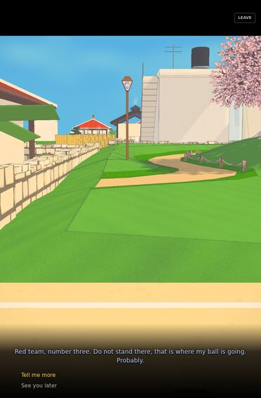 | 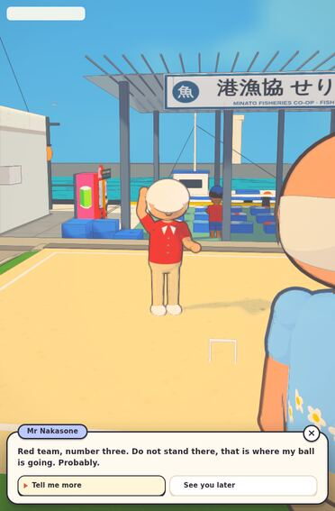 |
| 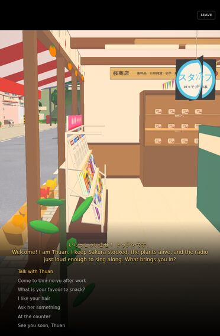 | 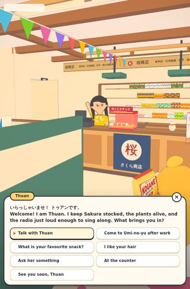 |
| 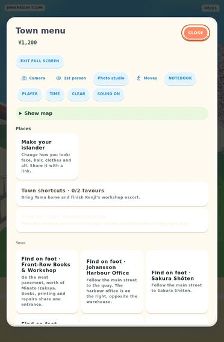 | 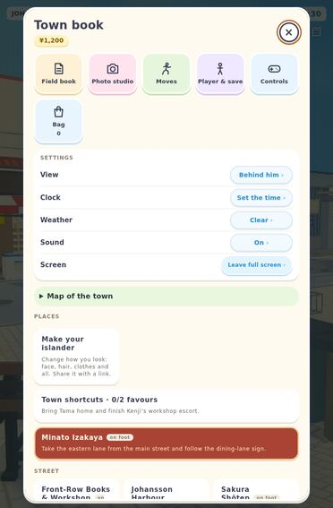 |

## Fixed in this pass

| # | Sev | Area | Defect | Repro | Fix |
|---|---|---|---|---|---|
| Q1 | S1 | Dialogue camera | Talking to someone left the camera on whatever you were facing (empty lawn, a shelf) instead of on the speaker. | Start the game (you begin seated on Sakura's bench) and talk to anyone. Or talk from a bench. | The over-the-shoulder framing gave up while seated. Seated, the view now turns to the speaker; standing, the shot cuts as designed. `game.js` `frameConversation` |
| Q2 | S1 | Dialogue logic | Ringing Sakura's bell at 08:00 opened a full conversation with Thuan, who was at home in Kitahama. | Enter Sakura before 09:00 and ring the bell. | When she is not in the shop, the bell is answered by nobody, or by Grandmother Sakurai from upstairs before opening. `activities.js` `resident` |
| Q3 | S1 | Audio / IP | The START chime was a square-wave B5 → E6 blip, essentially a well-known Nintendo pickup sound. | Press START. | Replaced with an original Johansson Co. jingle: four plucked notes up the Ryukyu scale (sol-ti-do-mi), like a sanshin, resolving on a soft open fifth. `index.html` `chime()` |
| Q4 | S2 | Rendering | Jagged edges on iPad. Tablets drew at 1.45× and the pixel budget then disabled supersampling, so a large iPad rendered at about 70% of screen resolution and was stretched up. | Any outdoor view on an iPad. | 4× MSAA on the scene target (resolved on chip by Apple GPUs), tablets at 1.85× DPR, phones at 1.5×. A frame-time governor steps resolution down on slow devices and never pumps back up. `ink-pipeline.js`, `game.js` |
| Q5 | S2 | HUD copy | "Quay before evening press." showed at 08:00 every day after the first. | Load a save on its second day. | The reminder compared total minutes instead of the time of day. It now fires only between 18:00 and 19:30, in plain words. `game.js`, `soft-quests.js` |
| Q6 | S2 | Dialogue UI | Subtitles over a black letterbox with no name tag. Replies were plain text lines with small hit areas, hard to tap on a tablet. | Talk to anyone. | A cream speech panel with the speaker's name on a tab in their colour. The line types itself out (tap to finish), with a ▼ cue. Replies are 44–46 px rounded buttons in two columns with a ▶ cursor, and Leave is a round ×. `base.css`, `dialogue-box.js` |
| Q7 | S2 | Menu | The town menu mixed actions and settings in one row of chips, in mixed capitals ("NOTEBOOK", "Camera", "SOUND ON"). The Minato Izakaya card was white text on white. | Open the menu. | It's now the **Town book**: icon tiles for things to do (Field book, Photo studio, Moves, Player & save, Controls, Bag), a settings list that reads *name → value* (View, Clock, Weather, Sound, Screen), and place cards without the repeated "Find on foot ·" prefix. Sentence case throughout. `index.html`, `tomodachi-ui.css`, `game.js`, `activities.js` |
| Q8 | S2 | Avatar | From behind, the horseshoe hair read as a bandage round Johansson's eyes. | Third-person view of Johansson (or any balding resident). | The band rises into a tufted crescent at the back of the head. `avatars/build.js` `hairRing` |
| Q9 | S2 | Placement | Gateball players stood at ground level inside the raised court, so only their heads showed. | Gateball court, 07:00–10:30 or 16:00–18:30. | Neighbours stand on the court terrace. `people/neighbours.js` |
| Q10 | S3 | HUD | Place name, clock and captions were 11–13 px on an iPad held at arm's length. | Any view on a tablet. | 14–17 px on tablets, and a larger action button. `tomodachi-ui.css` |
| Q11 | S3 | Sakura | Hanging POP cards sat at eye level, and the rubber plant's leaves looked like flying saucers. | Walk in from the door. | Cards are raised and smaller; leaves are long ovals angled out from the stem. `sakura-cheer.js`, `sakura-life.js` |

## Second pass (same day)

| Before | After |
|---|---|
| 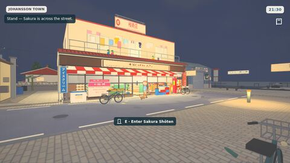 | 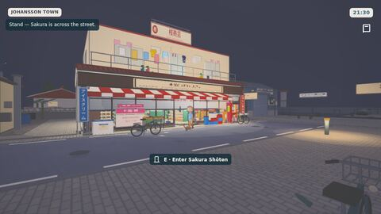 |
| 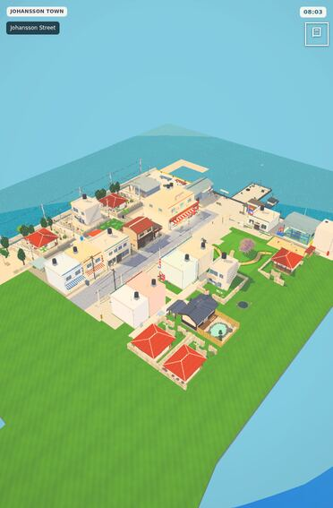 | 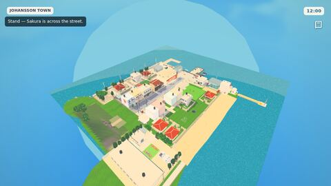 |

| # | Status | What was done |
|---|---|---|
| O1 | Fixed | The green slab was the Minato headland's skirt, 1.2 m under the water and showing through the shallows. It now sinks to 5.5 m and turns to sand and then reef below the tide line. The "square sea" left in the aerial shot is the audit camera's far plane cutting the sea from 110 m up. A player never sees it: at street level the sea runs to the fogged horizon. |
| O2 | Fixed | Night is a clear blue night now: lower fill and exposure at night, and the grade's light and shadow tints go to moonlight blue. Lit windows and lamps were the real bug: the cel pass draws a toon copy of every material, so the town's dusk glow updates went to the originals and nothing lit up. `cel.js` now links the copy to its original, and every kit building's glass and lamps (town hall, Kitahama, island homes) follow the clock. 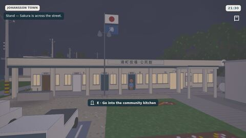 |
| O3 | By design | The Visitor's Guide as the landing page was a deliberate change (30 September), and a test pins it. Left as is. |
| O4 | Fixed | On a portrait screen the third-person lens stands 1.3× further back and slightly higher. 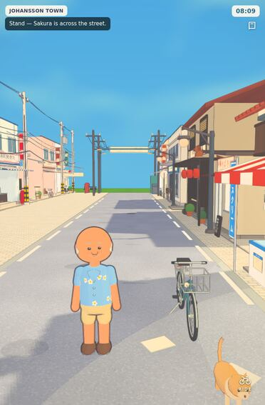 |
| O6 | Fixed | One string of paper flags, over the till end of the shop. |
| O7 | Fixed | The nobori stand at the two corners of Sakura's frontage, clear of the window. |
| O9 | Fixed | Voice blips: a soft note every few letters while a line types out, pitched per speaker in the Ryukyu scale. They play through the town's single audio context and follow the Sound setting. |
| O10 | Fixed | The flaky test was a resident walking through the door the ray test looked through. People are now left out of that check. |

## Open: logged for the next passes

| # | Sev | Area | Finding | Recommendation |
|---|---|---|---|---|
| O1 | S2 | World edge | From the air, the island sits on a flat green plane with straight edges in a square sea. | Horizon pass: a reef shelf, a surf line and haze at the map edge, and fade the base plane into sea. Already on the roadmap. |
| O2 | S2 | Night | Night is a grey haze rather than a town lit by its signs and windows. Classroom and office interiors are overexposed. | Night and interior lighting pass (next on the roadmap). |
| O3 | S2 | Title flow | On a touch tablet in portrait, the first screen can be the Visitor's Guide page rather than the Johansson Co. splash and PRESS START. | Check that `index.html` routes tablets to the title first. The guide should be a choice from the title, not the landing page. |
| O4 | S3 | Third-person camera | Behind Johansson the camera sits close: his head takes about a third of the frame on a portrait iPad, and it clips through the bench at start. | Pull the third-person distance out on portrait and tall screens, and raise it slightly while seated. |
| O5 | S3 | Photo studio | Works well, but it's styled as a web form (selects and sliders) rather than part of the game. | Restyle with the town-book tiles and chips; pose and expression as picture buttons. |
| O6 | S3 | Sakura | Bunting and hanging cards are still busy against the new wooden interior. | Consider one string of paper flags over the till only. |
| O7 | S3 | Clutter | The ice-cream nobori and the fruit trestle overlap Sakura's window from the street. | Move the nobori to the kerb corner. |
| O8 | S4 | Dialogue | No portrait or face close-up in the panel. Expressions only show in 3D. | Add a small live head render in the name tab (the photo studio already draws avatars to a canvas). |
| O10 | S3 | Tests | `alley-shops.test.mjs` failed once in a full parallel run (an unnamed mesh in front of a shop door) and passed 7 of 7 in isolation, with and without this pass's changes. | Probably a streamed detail racing the ray test. Wait for the detail stream to settle in the test, or name the mesh. |
| O9 | S4 | Audio | No voice blips when the line types out. | Add a per-speaker pitch blip, quiet, in the Ryukyu scale. |

## Verdict

The biggest problems a player meets in the first minute were Q1, Q3, Q4, Q5, Q6 and Q7: a camera that missed the person you're talking to, a borrowed chime, soft and jagged edges on iPad, a nonsense caption, hard-to-tap dialogue and a muddled menu. All of these are fixed. The game now reads as one product with a consistent rounded UI language. What remains is mostly the world edge (O1) and the night lighting (O2), which are the next two roadmap items.
