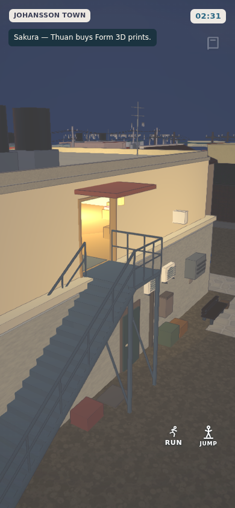
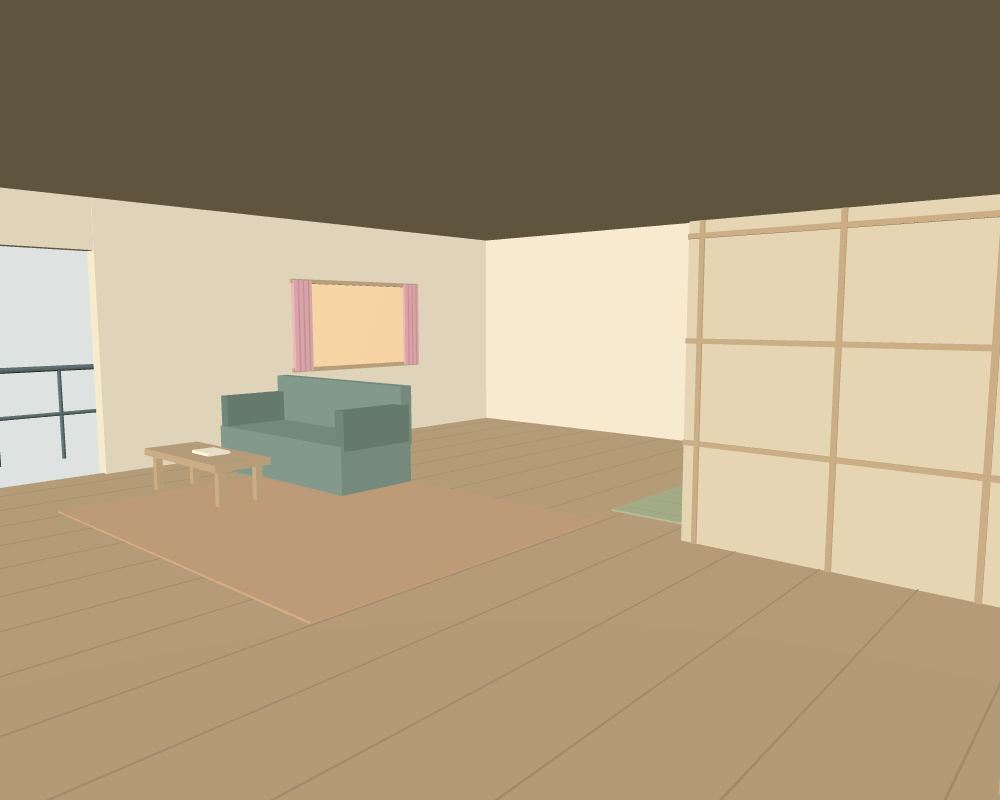

# Sakura rear stair and upstairs flat

The rear stair is now a physical walking route, with 24 closed steel treads, two
stringers, handrails, a supported landing and a 1.8 m rear doorway. The upper floor
is a hollow shell rather than a solid decorative mass. Its timber floor is at
Y=4.03 m, above the shop roof slab at Y=4.01 m. The rear services have condenser
louvers, brackets and a rainwater pipe. The landing has a canopy and porch lamp.

The accessible flat includes a shoe area, kitchen, refrigerator, dining table,
sewing desk, sofa, bedroom screen, bed, wardrobe, curtains and woven rugs. The
front terrace remains reachable through a separate opening. Furniture, floor,
stairs and rails use the existing quarter geometry/material batches. The quarter
retains its previous 79 non-sign mesh count. No Blender dependency or new model
load is required. This work uses authored geometry; it does not use or claim to
repair the separate supplied `.max` furniture.

Player support is height-aware and restricted to peninsula mode. A pedestrian
under the stair landing stays at ground level. The shop remains solid below its
roof; upper walls, furniture and rails block at their actual vertical intervals.
Ground routes, existing household schedules, interactions and save keys remain
unchanged. This makes the flat above Sakura accessible; it does not move the
existing Thuan/Nao household schedule away from its current residence.

Validation:

- `node --test tests/sakura-upstairs.test.mjs tests/okinawa-quarters.test.mjs tests/boot.test.mjs tests/bicycle-game.test.mjs tests/runtime-package.test.mjs`
- New geometry/grounding tests trace the entire stair, doorway, home and terrace
  route against the actual town colliders, check every generated vertex is finite,
  check furniture grounding and verify guards/material batching.
- The full game wiring test also walks up the stair, enters/exits the flat and
  descends using the actual fixed-step player movement.
- `node tests/sakura-upstairs.browser.mjs` checks published Chromium/WebGL
  movement at 390×844 and 1280×800. Set `CREATOR_CHROME` to a Chromium executable
  and `CODEX_PRIMARY_RUNTIME_NODE_MODULES` to the installed runtime modules.
  `SHOP_SCREENSHOTS` optionally sets an existing output folder.
- Native iPhone/iPad Safari is not available in this environment.

The published runtime must be rebuilt with `npm run build:runtime` after changing
source. This change is reviewed independently from PR #123's avatar/dining work.

## Review record — 1 October 2026

Rebased onto main `087dce15` after PR #123 landed. The focused geometry, quarter,
full-game movement, bicycle, runtime and preserved avatar/dining/combat checks
pass: 16 tests. Published Chromium/WebGL traversal also passes at 390×844 and
1280×800 on this rebased version. The visual review includes the rear facade in the published WebGL
runtime and a direct WebGL view of the furnished home.

The initial push was blocked by automatic approval review pending explicit
publication authorisation. The user authorised pushing this branch on 1 October
2026. The source and rebuilt runtime are committed on `codex/thuan-shop-home`.
