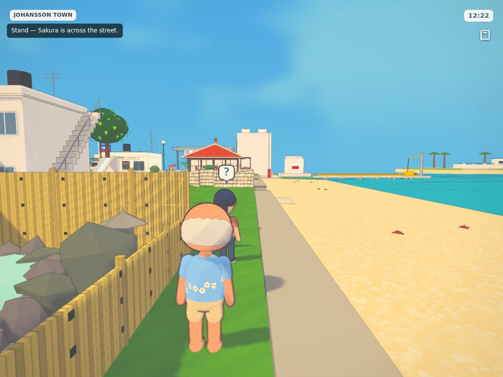
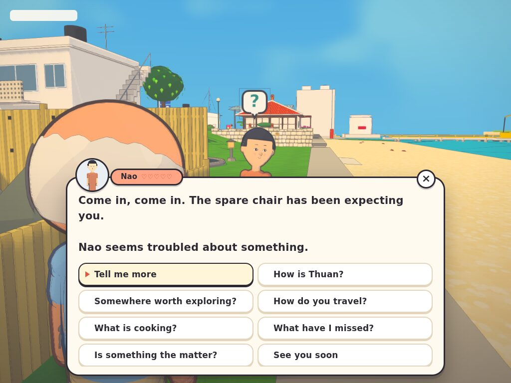
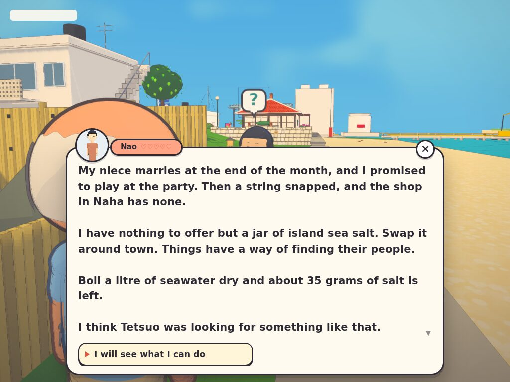

# Trade quests

A side story told through ten swaps, like the trading sequence in Zelda.
Code: `src/progression/trade-quest.js` (rules), `activities.js` (conversations),
`src/game.js` (the "?" card and the Town book line). Tests: `tests/trade-quest.test.mjs`.

| | |
|---|---|
|  |  |
|  | |

## How it plays

1. Someone on the street has a teal **?** card over their head. Talk to them and ask
   **Is something the matter?** They tell you their trouble (a snapped sanshin string before a
   wedding, an empty bottle of grandmother's chilli) and give you the only thing they can spare.
2. Somebody else in town wants that thing. They swap it for something new, and so on.
   Talk to anyone and choose **Show them the …** to try. The wrong person says no and gives the hint again.
3. The **tenth swap** brings the very thing the story needed. Take it back to the first person.
4. They finish the story and give you a **keepsake** (16 to collect, one of them rare), with
   yen or the thanks of everyone in the chain (friendship with each of them).
5. The next story is offered the **following town day**, by somebody else.

The Field book shows the running story, what you carry and which swap you are on, and lists
your keepsakes. The Town book shows who has a favour to ask.

## What makes each quest different

Each quest has its own random seed, kept in the save so it stays the same quest after a
reload. The seed picks:

- the story (seven so far: wedding, Obon, a letter to Brazil, the stopped clock, grandmother's
  soba, the kite contest, the little boat);
- who trades: never Thuan, never the same person twice in a row, nobody more than twice;
- the ten goods, from 32. Each one carries a short true fact (gears, fuses, tides, the soroban),
  so the swaps teach a little on the way;
- the lines, the hints and the reward.

Hints name the next person for the first three swaps. After that they are often riddles made
from what the residents are like ("Ask someone who fiddles with radios. Glasses, I think."),
and a riddle is only used if it fits nobody else on the street.

## Adding to it

- **A story:** add to `TRADE_STORIES`, with `trouble`, `goal` and `ending`. The goal must not be
  a trade good.
- **A good:** add to `TRADE_GOODS` with a `phrase` that reads inside a sentence and a `fact` that
  is true.
- **A keepsake:** add to `KEEPSAKES`.
- **A person:** add them to the street cast. They also need a personality entry, which gives the
  riddle hints.

Saved state is `state.trade`. `restoreTrade` drops a running quest if one of its people has left
the street cast or its story or goods are unknown; keepsakes and counts are kept.
