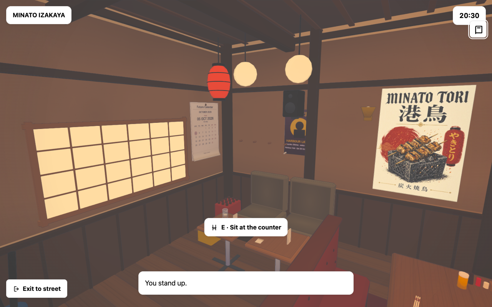
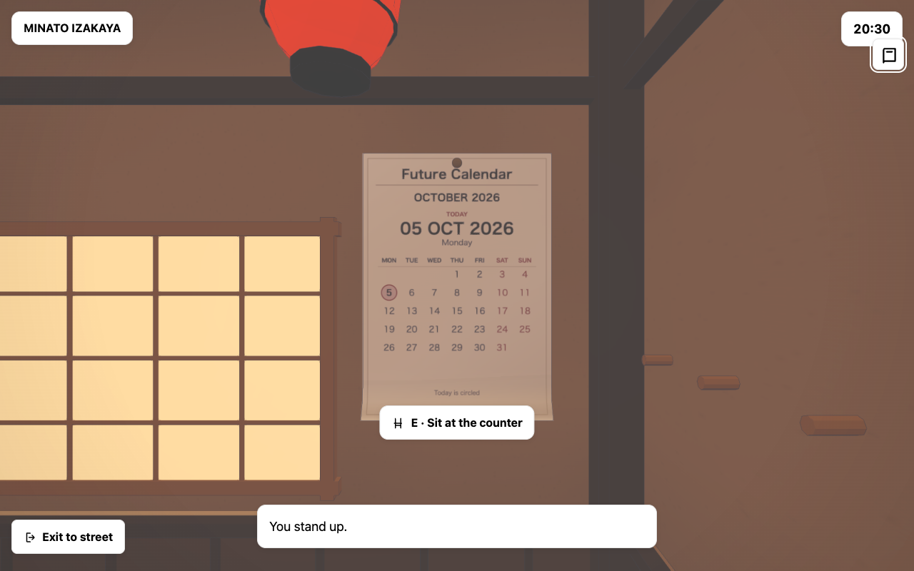
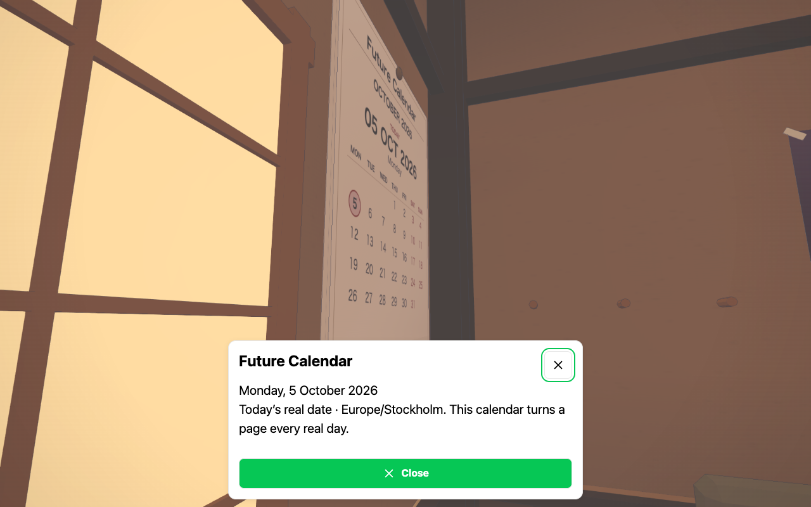

# Minato polish · 5 October 2026

The izakaya now has aged cedar grain, faint smoke/limewash marks, faded woven upholstery, stitched seat repairs and 25 small dining/service placements. Turned ceramic dishes, tea, partial lager mugs, chopstick sleeves, folded cloths and a service tray sit on actual furniture tops. No new floor clutter or collision volumes were added. Finishes use three merged draws and props four.

The previous fixed October 1997 calendar is replaced by **Future Calendar** beside the lounge shoji. It shows the real Stockholm date and highlights today, refreshing at real local midnight independently of town time, pause and menus. Calendar placement clears the window frame, timber post, picture rail and coat pegs. Large posters have also been moved clear of the rail and west sconce.

## Validation

- 33 focused tests passed: real-date/month/leap-year/year/DST rollovers, stable textures between dates, disposal, serving/furniture clearances, posters, seats, camera, weather and compiled runtime.
- Desktop and phone browser checks exercise midnight with a menu open, game-time independence, re-entry without duplicates and eight actual rendered views.
- Actual MCP server: 129 calls, 10/10 walked routes, full 1,408-cell dining/kitchen grid, calendar read through E, dining seat and normal doorway return; eight screenshots, zero browser errors and invalid transforms on the successful fresh session.
- Optional drink ordering was not completed or claimed by this focused walk.
- Installed web-game Playwright client also captured actual gameplay and keyboard movement.

The captures use a fixed real-date fixture (5 October 2026) for reproducibility. Gameplay uses the current real date. The build retains the last published main runtime graph for cached pages.
