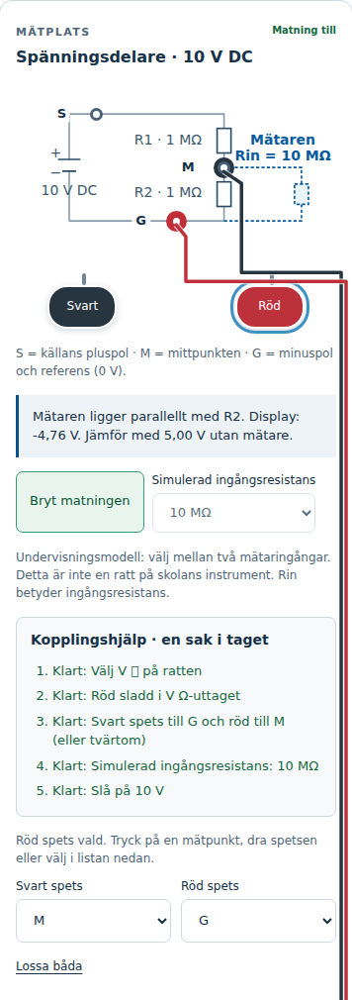
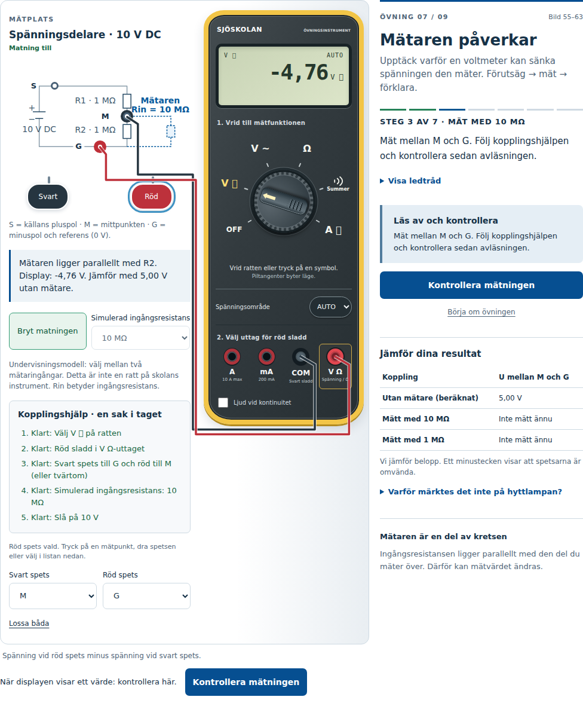

# Övning 7: visuell kontroll och interaktion, 27 september 2026

Utgångspunkt: `main` vid `0542b9206e7c46a6afe25b8c96405fce7a3c4b77`, efter sammanslagningen av PR #112 och senare Station A-ändringar. Ingen ändring av övningens innehåll, gränsvärden, modell eller databasgenererade uppgifter.

## Resultat i Chromium 141.0.7390.37

| Storlek (CSS-pixlar) | Inmatning | Sju steg, protokoll/CSV och fria/handledda lägen | Visuell kontroll efter rättning |
| --- | --- | --- | --- |
| 390 × 844 | Pekemulering, tryck och dragning | Godkänt | Godkänt |
| 820 × 1180 | Pekemulering, tryck och dragning | Godkänt | Godkänt |
| 1024 × 768 | Mus, formulärfält | Godkänt | Godkänt |
| 1440 × 1000 | Mus, formulärfält | Godkänt | Godkänt |

24 befintliga modell-/DOM-tester och 10 webbläsartester godkända. Två dragtester hoppas avsiktligt över i skrivbordsprojekten, eftersom de endast avser pekinmatning. Inga JavaScript-undantag i hela lektionsflödet.

## Reproducerade och rättade fel

- SVG-etiketterna krympte till cirka 8,1 px på telefon, 10,3 px på surfplatta och 7,6 px vid 1024 px bredd. Nu anpassas teckenstorleken till diagrammets faktiska bredd, med cirka 14 px som minsta visningsstorlek.
- Handtaget för röd spets täckte texten för mätarens ingångsresistans. Handtagen har nu en egen rad under schemat. Nodnamnen ligger vid sidan av punkterna, så att G inte sammanfaller med R2-texten.
- Sladdarna korsade återkoppling, kopplingshjälp och mätardisplay på den smala layouten. De följer nu mätplatsens kant. Grenens etiketter ligger ovanför den streckade resistorn, fria från sladdarna.
- I första förutsägelsen kunde sladdar dras mot det övre vänstra hörnet eftersom dolda, oanslutna handtag saknade position. Inga sådana sladdar ritas nu.

Återstående gränssnittsbeteende fungerade och behövde inte ändras:

- Mätplatsens reglage är inerta under förutsägelser, Kirchhoff och förklaring samt efter godkänd mätning. De återaktiveras inför nästa mätning och i fri övning. Diagram och lästext förblir tillgängliga. Ett fokusförsök på ratten blockeras när reglagen är inerta.
- 10 MΩ-steget låser ingångsväljaren; 1 MΩ-steget tillåter ändring. Båda ger fem klara punkter i kopplingshjälpen.
- Omvända spetsar ger −4,76 V respektive −3,33 V och godkänns med förklaring av minustecknet. Resultattabellen jämför beloppen.
- Felaktiga svar ger återkoppling och låser inte upp nästa steg. Svensk decimal fungerar. Kirchhoff godkänner 6,67 V; sista steget kräver rätt alternativ och egen förklaring.
- Alla sju protokollrader visas och sparas efter omladdning. Den faktiskt nedladdade CSV-filen innehåller båda avläsningarna, ingångsresistanserna och förklaringen.
- Sidan och dess knappar kräver ingen horisontell rullning. Den breda protokolltabellen har en egen rullyta; sista kolumnen kan nås där.
- Byte till fri övning från förutsägelse, pågående mätning eller sparad mätning tar bort gamla frågor, kopplingshjälp, resultatpanel och mätknappar. Tillbaka till handledning startar steg 1 med tomt svar och återställd mätare, samtidigt som protokollhistoriken behålls.
- Dragning av båda spetsarna och vridning av ratten fungerar via emulerade pekhändelser utan att gesten rullar sidan.

## Skärmbilder efter rättning

Telefonens schema, reglage och kopplingshjälp (390 px):

Skrivbordslayout vid 1024 px, tidigare den mest hopträngda bredden:

## Avgränsning och kvarstående kontroll

Detta är verklig Chromium-rendering och browser-inmatning i en lokal HTTP-server, inklusive pekemulering; ingen fysisk telefon eller surfplatta har använts. Skärmbilderna har granskats. Instrumentets sällsynta symboltecken påverkas av den lokala Linux-miljöns teckensnitt; granskningen är inte ett godkännande av alla enheters teckensnitt.

WebKit-projekten finns i sviten men är inte godkända i denna körning: native-bibliotek saknas och miljön tillät inte installationen. GitHub Actions-jobbet [36325837253](https://github.com/nj22az/nj22az.github.io/actions/runs/36325837253) startade inte; GitHub rapporterade en faktureringsspärr på kontot. Det är ett körmiljöhinder, inte ett testresultat för applikationen.

Fysisk acceptans återstår på iPhone/iPad/Safari: genomför de sju stegen, dra spetsar och ratt med finger, kontrollera menyer med skärmtangentbord öppet och öppna CSV i enhetens delnings-/filflöde. Webbläsartesterna ersätter inte dessa kontroller.
